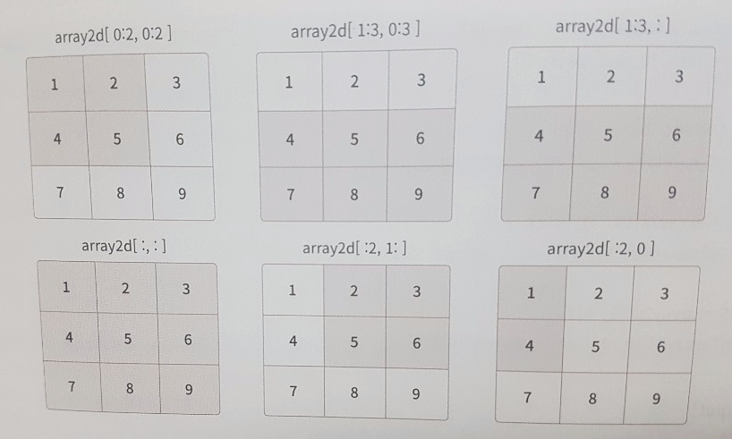
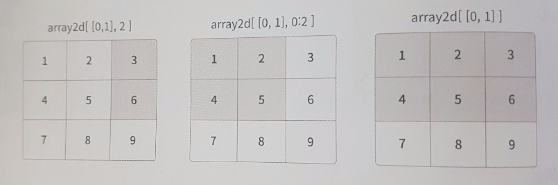
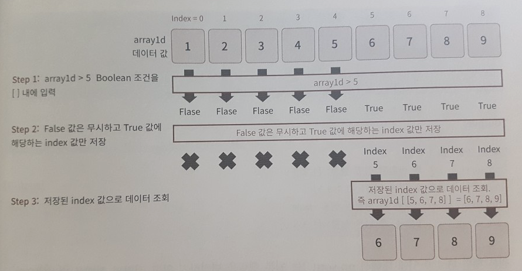
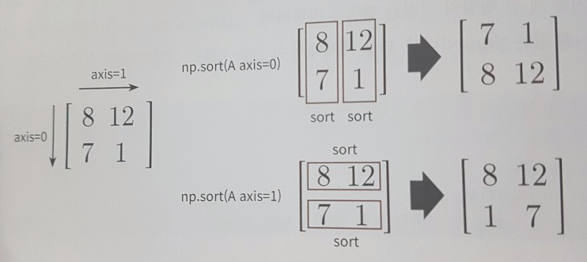

# 1장. 파이썬 기반의 머신러닝과 생태계 이해

* [1.1. 머신러닝의 개념](#1.1.-머신러닝의-개념)
* 1.2. 파이썬 머신러닝 생태계를 구성하는 주요 패키지
* [1.3. 넘파이](#1.3.-넘파이)
* [1.4. 데이터 핸들링 - 판다스](#1.4.-데이터-핸들링---판다스)

<br>

## 1.1. 머신러닝의 개념

* 머신러닝(Machine Learning)의 개념은 다양하게 표현할 수 있으나, 일반적으로는 애플리케이션을 수정하지 않고도 데이터를 기반으로 패턴을 학습하고 결과를 예측하는 알고리즘 기법을 통칭합니다.
* 업무적으로 복잡한 조건/규칙들이 다양한 형태로 결합하고 시시각각 변하면서 도저히 소프트웨어 코드로 로직을 구성하여 이들을 관통하는 일정한 패턴을 찾기 어려운 경우에 머신러닝은 훌륭한 솔루션을 제공합니다.
* 머신러닝은 인간의 언어에서 패턴을 규정하기 어려운 문제를 데이터를 기반으로 숨겨진 패턴을 인지해 해결합니다.
* 머신러닝 알고리즘은 데이터를 기반으로 통계적인 신뢰도를 강화하고 예측 오류를 최소화하기 위한 다양한 수학적 기법을 적용해 데이터 내의 패턴을 스스로 인지하고 신뢰도 있는 예측 결과를 도출해 냅니다.
* 데이터 분석 영역은 재빠르게 머신러닝 기반의 예측 분석(Predictive Analysis)으로 재편되고 있습니다.
* 데이터마이닝, 영상 인식, 음성 인식, 자연어처리에서 개발자가 데이터나 업무 로직의 특성을 직접 감안한 프로그램을 만들 경우 난이도와 개발 복잡도가 너무 높아질 수 밖에 없는 분야에서 머신러닝이 급속하게 발전하고 있습니다.
* 머신러닝의 큰 단점은 데이터에 매우 의존적이라는 것입니다. 가비지 인(Garbage In), 가비지 아웃(Garbage out).
* 최적의 머신러닝 알고리즘과 모델 파라미터를 구축하는 능력도 중요하지만 데이터를 이해하고 효율적으로 가공, 처리, 추출해 최적의 데이터를 기반으로 알고리즘을 구동할 수 있도록 준비하는 능력이 더 중요할 수 있습니다.

## 1.3. 넘파이

#### Numpy ndarray 개요

```python
import numpy as np

array1 = np.array([1,2,3])
print('array1 type:',type(array1))
print('array1 array 형태:',array1.shape)

array2 = np.array([[1,2,3],
                  [2,3,4]])
print('array2 type:',type(array2))
print('array2 array 형태:',array2.shape)

array3 = np.array([[1,2,3]])
print('array3 type:',type(array3))
print('array3 array 형태:',array3.shape)
```
```
array1 type: <class 'numpy.ndarray'>
array1 array 형태: (3,)
array2 type: <class 'numpy.ndarray'>
array2 array 형태: (2, 3)
array3 type: <class 'numpy.ndarray'>
array3 array 형태: (1, 3)
```
```python
print('array1: {:0}차원, array2: {:1}차원, array3: {:2}차원'.format(array1.ndim,array2.ndim,array3.ndim))
```
```
array1: 1차원, array2: 2차원, array3:  2차원
```
```python
list1 = [1,2,3]
print(type(list1))
array1 = np.array(list1)
print(type(array1))
print(array1, array1.dtype)
```
```
<class 'list'>
<class 'numpy.ndarray'>
[1 2 3] int64
```
```python
list2 = [1, 2, 'test']
array2 = np.array(list2)
print(array2, array2.dtype)
# ['1' '2' 'test'] <U21 
# 숫자형 값 1, 2는 모두 문자열값인 '1', '2'로 변환.
# ndarray는 데이터값이 모두 같은 데이터 타입이어야 함.
# 다른 데이터 타입인 경우, 더 큰 데이터 타입으로 변환됨. (여기선 int형이 유니코드 문자열 값으로 변환)

list3 = [1, 2, 3.0]
array3 = np.array(list3)
print(array3, array3.dtype)
# int보다 float이 더 큰 데이터 타입임.
```
```
['1' '2' 'test'] <U21
[1. 2. 3.] float64
```
```python
# 데이터 타입 변경
# 메모리를 절약해야 할 때 보통 이용

array_int = np.array([1, 2, 3])
array_float = array_int.astype('float64')
print(array_float, array_float.dtype)

array_int1= array_float.astype('int32')
print(array_int1, array_int1.dtype)

array_float1 = np.array([1.1, 2.1, 3.1])
array_int2= array_float1.astype('int32')
print(array_int2, array_int2.dtype)
```
```
[1. 2. 3.] float64
[1 2 3] int32
[1 2 3] int32
```

#### ndarray를 편리하게 생성하기 - arange, zeros, ones

```python
sequence_array = np.arange(10)
print(sequence_array)
print(sequence_array.dtype, sequence_array.shape)
```
```
[0 1 2 3 4 5 6 7 8 9]
int64 (10,)
```
```python
zero_array = np.zeros((3,2),dtype='int32')
print(zero_array)
print(zero_array.dtype, zero_array.shape)

one_array = np.ones((3,2))
print(one_array)
print(one_array.dtype, one_array.shape)
```
```
[[0 0]
 [0 0]
 [0 0]]
int32 (3, 2)
[[1. 1.]
 [1. 1.]
 [1. 1.]]
float64 (3, 2)
```

#### reshape

```python
array1 = np.arange(10)
print('array1:\n', array1)

array2 = array1.reshape(2,5)
print('array2:\n',array2)

array3 = array1.reshape(5,2)
print('array3:\n',array3)
```
```
array1:
 [0 1 2 3 4 5 6 7 8 9]
array2:
 [[0 1 2 3 4]
 [5 6 7 8 9]]
array3:
 [[0 1]
 [2 3]
 [4 5]
 [6 7]
 [8 9]]
```
```python
array1.reshape(4,3)
```
```
---------------------------------------------------------------------------
ValueError                                Traceback (most recent call last)
<ipython-input-13-a40469ec5825> in <module>
----> 1 array1.reshape(4,3)

ValueError: cannot reshape array of size 10 into shape (4,3)
```
```python
# reshape의 -1 인자
# 원래 ndarray와 호환되는 새로운 shape를 변환해 줌.
# 즉, 하나의 축만 남겨놓고 해당 축을 -1로 할당하면 자동으로 dimension을 할당해 줌.

array1 = np.arange(10)
print(array1)

array2 = array1.reshape(-1,5)
print('array2 shape:',array2.shape)

array3 = array1.reshape(5,-1)
print('array3 shape:',array3.shape)
```
```
[0 1 2 3 4 5 6 7 8 9]
array2 shape: (2, 5)
array3 shape: (5, 2)
```
```python
array1 = np.arange(10)
array4 = array1.reshape(-1,4)
```
```
---------------------------------------------------------------------------
ValueError                                Traceback (most recent call last)
<ipython-input-16-07da9760475e> in <module>
      1 array1 = np.arange(10)
----> 2 array4 = array1.reshape(-1,4)

ValueError: cannot reshape array of size 10 into shape (4)
```
```python
array1 = np.arange(8)
array3d = array1.reshape((2,2,2))
print('array3d:\n',array3d.tolist())

# 3차원 ndarray를 2차원 ndarray로 변환
array5 = array3d.reshape(-1,1)
print('array5:\n',array5.tolist())
print('array5 shape:',array5.shape)

# 1차원 ndarray를 2차원 ndarray로 변환
array6 = array1.reshape(-1,1)
print('array6:\n',array6.tolist())
print('array6 shape:',array6.shape)
```
```
array3d:
 [[[0, 1], [2, 3]], [[4, 5], [6, 7]]]
array5:
 [[0], [1], [2], [3], [4], [5], [6], [7]]
array5 shape: (8, 1)
array6:
 [[0], [1], [2], [3], [4], [5], [6], [7]]
array6 shape: (8, 1)
```

### indexing

#### 단일값 추출

```python
# 1에서 부터 9 까지의 1차원 ndarray 생성 
array1 = np.arange(start=1, stop=10)
print('array1:',array1)
# index는 0 부터 시작하므로 array1[2]는 3번째 index 위치의 데이터 값을 의미
value = array1[2]
print('value:',value)
print(type(value))
```
```
array1: [1 2 3 4 5 6 7 8 9]
value: 3
<class 'numpy.int64'>
```
```python
print('맨 뒤의 값:',array1[-1], ', 맨 뒤에서 두번째 값:',array1[-2])
```
```
맨 뒤의 값: 9 , 맨 뒤에서 두번째 값: 8
```
```python
array1[0] = 9
array1[8] = 0
print('array1:',array1)
```
```
array1: [9 2 3 4 5 6 7 8 0]
```
```python
array1d = np.arange(start=1, stop=10)
array2d = array1d.reshape(3,3)
print(array2d)

print('(row=0,col=0) index 가리키는 값:', array2d[0,0] )
print('(row=0,col=1) index 가리키는 값:', array2d[0,1] )
print('(row=1,col=0) index 가리키는 값:', array2d[1,0] )
print('(row=2,col=2) index 가리키는 값:', array2d[2,2] )
```
```
[[1 2 3]
 [4 5 6]
 [7 8 9]]
(row=0,col=0) index 가리키는 값: 1
(row=0,col=1) index 가리키는 값: 2
(row=1,col=0) index 가리키는 값: 4
(row=2,col=2) index 가리키는 값: 9
```

#### slicing

```python
array1 = np.arange(start=1, stop=10)
array3 = array1[0:3]
print(array3)
print(type(array3))
```
```
[1 2 3]
<class 'numpy.ndarray'>
```
```python
array1 = np.arange(start=1, stop=10)
array4 = array1[:3]
print(array4)

array5 = array1[3:]
print(array5)

array6 = array1[:]
print(array6)
```
```
[1 2 3]
[4 5 6 7 8 9]
[1 2 3 4 5 6 7 8 9]
```



```python
array1d = np.arange(start=1, stop=10)
array2d = array1d.reshape(3,3)
print('array2d:\n',array2d)
print('\n')
print('array2d[0:2, 0:2] \n', array2d[0:2, 0:2])
print('array2d[1:3, 0:3] \n', array2d[1:3, 0:3])
print('array2d[1:3, :] \n', array2d[1:3, :])
print('array2d[:, :] \n', array2d[:, :])
print('array2d[:2, 1:] \n', array2d[:2, 1:])
print('array2d[:2, 0] \n', array2d[:2, 0])
```
```
array2d:
 [[1 2 3]
 [4 5 6]
 [7 8 9]]


array2d[0:2, 0:2] 
 [[1 2]
 [4 5]]
array2d[1:3, 0:3] 
 [[4 5 6]
 [7 8 9]]
array2d[1:3, :] 
 [[4 5 6]
 [7 8 9]]
array2d[:, :] 
 [[1 2 3]
 [4 5 6]
 [7 8 9]]
array2d[:2, 1:] 
 [[2 3]
 [5 6]]
array2d[:2, 0] 
 [1 4]
```
```python
print(array2d[0])
print(array2d[1])
print('array2d[0] shape:', array2d[0].shape, 'array2d[1] shape:', array2d[1].shape )
```
```
[1 2 3]
[4 5 6]
array2d[0] shape: (3,) array2d[1] shape: (3,)
```

#### fancy indexing

팬시 인덱싱은 리스트나 ndarray로 인덱스 집합을 지정하면 해당 위치의 인덱스에 해당하는 ndarray를 반환하는 인덱싱 방식이다.



```python
array1d = np.arange(start=1, stop=10)
array2d = array1d.reshape(3,3)

array3 = array2d[[0,1], 2]
print('array2d[[0,1], 2] => ',array3.tolist())

array4 = array2d[[0,1], 0:2]
print('array2d[[0,1], 0:2] => ',array4.tolist())

array5 = array2d[[0,1]]
print('array2d[[0,1]] => ',array5.tolist())
```
```
array2d[[0,1], 2] =>  [3, 6]
array2d[[0,1], 0:2] =>  [[1, 2], [4, 5]]
array2d[[0,1]] =>  [[1, 2, 3], [4, 5, 6]]
```

#### boolean indexing



```python
array1d = np.arange(start=1, stop=10)
# [ ] 안에 array1d > 5 Boolean indexing을 적용 
array3 = array1d[array1d > 5]
print('array1d > 5 불린 인덱싱 결과 값 :', array3)
```
```
array1d > 5 불린 인덱싱 결과 값 : [6 7 8 9]
```
```python
array1d > 5
```
```
array([False, False, False, False, False,  True,  True,  True,  True])
```
```python
boolean_indexes = np.array([False, False, False, False, False,  True,  True,  True,  True])
array3 = array1d[boolean_indexes]
print('불린 인덱스로 필터링 결과 :', array3)
```
```
불린 인덱스로 필터링 결과 : [6 7 8 9]
```
```python
indexes = np.array([5,6,7,8])
array4 = array1d[ indexes ]
print('일반 인덱스로 필터링 결과 :',array4)
```
```
일반 인덱스로 필터링 결과 : [6 7 8 9]
```

### 행렬의 정렬 – sort( )와 argsort( )

#### 행렬 정렬

```python
# 오름차순 (default)

org_array = np.array([ 3, 1, 9, 5]) 
print('원본 행렬:', org_array)
# np.sort( )로 정렬 
sort_array1 = np.sort(org_array)         
print ('np.sort( ) 호출 후 반환된 정렬 행렬:', sort_array1) 
print('np.sort( ) 호출 후 원본 행렬:', org_array)
# ndarray.sort( )로 정렬
sort_array2 = org_array.sort() # inplace=True 하고 같은 효과를 준다.
print('org_array.sort( ) 호출 후 반환된 행렬:', sort_array2)
print('org_array.sort( ) 호출 후 원본 행렬:', org_array)
```
```
원본 행렬: [3 1 9 5]
np.sort( ) 호출 후 반환된 정렬 행렬: [1 3 5 9]
np.sort( ) 호출 후 원본 행렬: [3 1 9 5]
org_array.sort( ) 호출 후 반환된 행렬: None
org_array.sort( ) 호출 후 원본 행렬: [1 3 5 9]
```
```python
# 내림차순

sort_array1_desc = np.sort(org_array)[::-1]
print ('내림차순으로 정렬:', sort_array1_desc) 
```
```
내림차순으로 정렬: [9 5 3 1]
```



```python
array2d = np.array([[8, 12], 
                   [7, 1 ]])

sort_array2d_axis0 = np.sort(array2d, axis=0)
print('로우 방향으로 정렬:\n', sort_array2d_axis0)

sort_array2d_axis1 = np.sort(array2d, axis=1)
print('컬럼 방향으로 정렬:\n', sort_array2d_axis1)
```
```
로우 방향으로 정렬:
 [[ 7  1]
 [ 8 12]]
컬럼 방향으로 정렬:
 [[ 8 12]
 [ 1  7]]
```

#### 정렬 행렬의 인덱스 반환


* argsort()는 넘파이에서 활용도가 높다.
* 넘파이의 ndarray는 RDBMS의 TABLE 칼럼이나 판다스 DataFrame 컬럼과 같은 메타 데이터를 가질 수 없다.
* 따라서, 실제 값과 그 값이 뜻하는 메타 데이터를 별로의 ndarray로 각각 가져야 한다.


```python
org_array = np.array([ 3, 1, 9, 5]) 
sort_indices = np.argsort(org_array)
print(type(sort_indices))
print('행렬 정렬 시 원본 행렬의 인덱스:', sort_indices)
```
```
<class 'numpy.ndarray'>
행렬 정렬 시 원본 행렬의 인덱스: [1 0 3 2]
```

```python
org_array = np.array([ 3, 1, 9, 5]) 
sort_indices_desc = np.argsort(org_array)[::-1]
print('행렬 내림차순 정렬 시 원본 행렬의 인덱스:', sort_indices_desc)
```
```
행렬 내림차순 정렬 시 원본 행렬의 인덱스: [2 3 0 1]
```
```python
import numpy as np

name_array = np.array(['John', 'Mike', 'Sarah', 'Kate', 'Samuel'])
score_array= np.array([78, 95, 84, 98, 88])

sort_indices_asc = np.argsort(score_array)
print('성적 오름차순 정렬 시 score_array의 인덱스:', sort_indices_asc)
print('성적 오름차순으로 name_array의 이름 출력:', name_array[sort_indices_asc])
```
```
성적 오름차순 정렬 시 score_array의 인덱스: [0 2 4 1 3]
성적 오름차순으로 name_array의 이름 출력: ['John' 'Sarah' 'Samuel' 'Mike' 'Kate']
```

### 선형대수 연산 – 행렬 내적과 전치 행렬 구하기

#### 행렬 내적

```python
A = np.array([[1, 2, 3],
              [4, 5, 6]])
B = np.array([[7, 8],
              [9, 10],
              [11, 12]])

dot_product = np.dot(A, B)
print('행렬 내적 결과:\n', dot_product)
```
```
행렬 내적 결과:
 [[ 58  64]
 [139 154]]
```

#### 전치 행렬

```python
A = np.array([[1, 2],
              [3, 4]])
transpose_mat = np.transpose(A)
print('A의 전치 행렬:\n', transpose_mat)
```
```
A의 전치 행렬:
 [[1 3]
 [2 4]]
```

## 1.4. 데이터 핸들링 - 판다스

* 넘파이는 저수준 API가 대부분이므로 데이터 핸들링이 편하다고 말하기 어렵다.
* 판다스는 많은 부분이 넘파이 기반으로 작성됐는데, 넘파이보다 훨씬 유연하고 편리하게 데이터 핸들링이 가능하게 해준다.
* RDBMS의 SQL이나 엑셀 시트의 편의성만큼은 아니더라도, 판다스는 이에 버금가는 고수준 API를 제공한다.
* 판다스는 파이썬의 리스트, 컬렉션, 넘파이 등의 내부 데이터뿐만 아니라 CSV 등의 파일을 쉽게 DataFrame으로 변경해 데이터의 가공/분석을 편하게 수행하게 해준다.

### Pandas 시작- 파일을 DataFrame 로딩, 기본 API

https://www.kaggle.com/c/titanic

```python
import pandas as pd

titanic_df = pd.read_csv('titanic_train.csv')
print('titanic 변수 type:',type(titanic_df))
print(titanic_df.head(5))
```
```
   PassengerId  Survived  Pclass  \
0            1         0       3   
1            2         1       1   
2            3         1       3   
3            4         1       1   
4            5         0       3   

                                                Name     Sex   Age  SibSp  \
0                            Braund, Mr. Owen Harris    male  22.0      1   
1  Cumings, Mrs. John Bradley (Florence Briggs Th...  female  38.0      1   
2                             Heikkinen, Miss. Laina  female  26.0      0   
3       Futrelle, Mrs. Jacques Heath (Lily May Peel)  female  35.0      1   
4                           Allen, Mr. William Henry    male  35.0      0   

   Parch            Ticket     Fare Cabin Embarked  
0      0         A/5 21171   7.2500   NaN        S  
1      0          PC 17599  71.2833   C85        C  
2      0  STON/O2. 3101282   7.9250   NaN        S  
3      0            113803  53.1000  C123        S  
4      0            373450   8.0500   NaN        S  
```

```python
print('DataFrame 크기: ', titanic_df.shape)
```
```
DataFrame 크기:  (891, 12)
```

```python
titanic_df.info()

# object는 문자열 타입이라 생각해도 무방.
# non-null 개수 표시
```
```
<class 'pandas.core.frame.DataFrame'>
RangeIndex: 891 entries, 0 to 890
Data columns (total 12 columns):
PassengerId    891 non-null int64
Survived       891 non-null int64
Pclass         891 non-null int64
Name           891 non-null object
Sex            891 non-null object
Age            714 non-null float64
SibSp          891 non-null int64
Parch          891 non-null int64
Ticket         891 non-null object
Fare           891 non-null float64
Cabin          204 non-null object
Embarked       889 non-null object
dtypes: float64(2), int64(5), object(5)
memory usage: 83.7+ KB
```

* describe()
   * 데이터 분포도를 아는 것은 머신러닝 알고리즘의 성능을 향상시키는 중요한 요소임
   * 정확한 분포도를 알기는 무리지만, 개략적인 수준의 분포도를 확인할 수 있어 유용함
   * count: not null인 데이터 건수
   * 해당 숫자 칼럼이 숫자형 카테고리 칼럼인지 판단할 수 있게 도와줌
      * min/max 등을 보고 숫자형 카테고리 칼럼인지 유추할 수 있음

```python
print(titanic_df.describe())
```
```
       PassengerId    Survived      Pclass         Age       SibSp  \
count   891.000000  891.000000  891.000000  714.000000  891.000000   
mean    446.000000    0.383838    2.308642   29.699118    0.523008   
std     257.353842    0.486592    0.836071   14.526497    1.102743   
min       1.000000    0.000000    1.000000    0.420000    0.000000   
25%     223.500000    0.000000    2.000000   20.125000    0.000000   
50%     446.000000    0.000000    3.000000   28.000000    0.000000   
75%     668.500000    1.000000    3.000000   38.000000    1.000000   
max     891.000000    1.000000    3.000000   80.000000    8.000000   

            Parch        Fare  
count  891.000000  891.000000  
mean     0.381594   32.204208  
std      0.806057   49.693429  
min      0.000000    0.000000  
25%      0.000000    7.910400  
50%      0.000000   14.454200  
75%      0.000000   31.000000  
max      6.000000  512.329200  
```

* .value_counts()
   * 데이터의 분포도를 확인하는 데 매우 유용한 함수
   * 반환하는 데이터 타입은 Series 객체
   * Series의 인덱스는 숫자형뿐만 아니라 문자열도 가능 (단, 고유성은 보장되어야 함)

```python
value_counts = titanic_df['Pclass'].value_counts()
print(value_counts)
```
```
3    491
1    216
2    184
Name: Pclass, dtype: int64
```

```python
titanic_pclass = titanic_df['Pclass']
print(type(titanic_pclass))
```
```
<class 'pandas.core.series.Series'>
```

```python
titanic_pclass.head(5)
```
```
0    3
1    1
2    3
3    1
4    3
Name: Pclass, dtype: int64
```

```python
value_counts = titanic_df['Pclass'].value_counts()
print(type(value_counts))
print(value_counts)
```
```
<class 'pandas.core.series.Series'>
3    491
1    216
2    184
Name: Pclass, dtype: int64
```

### DataFrame과 리스트, 딕셔너리, 넘파이 ndarray 상호 변환

#### 넘파이 ndarray, 리스트, 딕셔너리를 DataFrame으로 변환하기

* 사이킷런의 많은 API는 DataFrame을 인자로 입력 받을 수 있지만, 기본적으로 넘파이 ndarray를 입력 인자로 사용하는 경우가 대부분.
* 따라서 DataFrame과 넘파이 ndarray 상호 간의 변환은 매우 빈번하게 발생함.

```python
import numpy as np

col_name1=['col1']
list1 = [1, 2, 3]
array1 = np.array(list1)

print('array1 shape:', array1.shape )
df_list1 = pd.DataFrame(list1, columns=col_name1) # 컬럼명 지정
print('1차원 리스트로 만든 DataFrame:\n', df_list1)
df_array1 = pd.DataFrame(array1, columns=col_name1)
print('1차원 ndarray로 만든 DataFrame:\n', df_array1)
```
```
array1 shape: (3,)
1차원 리스트로 만든 DataFrame:
    col1
0     1
1     2
2     3
1차원 ndarray로 만든 DataFrame:
    col1
0     1
1     2
2     3
```

```python
# 3개의 컬럼명이 필요함. 
col_name2=['col1', 'col2', 'col3']

# 2행x3열 형태의 리스트와 ndarray 생성 한 뒤 이를 DataFrame으로 변환. 
list2 = [[1, 2, 3],
         [11, 12, 13]]
array2 = np.array(list2)
print('array2 shape:', array2.shape )
df_list2 = pd.DataFrame(list2, columns=col_name2)
print('2차원 리스트로 만든 DataFrame:\n', df_list2)
df_array2 = pd.DataFrame(array2, columns=col_name2)
print('2차원 ndarray로 만든 DataFrame:\n', df_array2)
```
```
array2 shape: (2, 3)
2차원 리스트로 만든 DataFrame:
    col1  col2  col3
0     1     2     3
1    11    12    13
2차원 ndarray로 만든 DataFrame:
    col1  col2  col3
0     1     2     3
1    11    12    13
```

```python
# Key는 컬럼명으로 매핑, Value는 리스트 형(또는 ndarray)
dict = {'col1':[1, 11], 'col2':[2, 22], 'col3':[3, 33]}
df_dict = pd.DataFrame(dict)
print('딕셔너리로 만든 DataFrame:\n', df_dict)
```
```
딕셔너리로 만든 DataFrame:
    col1  col2  col3
0     1     2     3
1    11    22    33
```

#### DataFrame을 넘파이 ndarray, 리스트, 딕셔너리로 변환하기

* 많은 머신러닝 패키지가 기본 데이터 형으로 넘파이 ndarray를 사용한다.
* values를 이용한 ndarray로의 변환은 매우 많이 사용된다.

```python
# DataFrame을 ndarray로 변환
array3 = df_dict.values
print('df_dict.values 타입:', type(array3), 'df_dict.values shape:', array3.shape)
print(array3)

# DataFrame을 리스트로 변환
list3 = df_dict.values.tolist()
print('df_dict.values.tolist() 타입:', type(list3))
print(list3)

# DataFrame을 딕셔너리로 변환
dict3 = df_dict.to_dict('list')
print('\n df_dict.to_dict() 타입:', type(dict3))
print(dict3)
```
```
df_dict.values 타입: <class 'numpy.ndarray'> df_dict.values shape: (2, 3)
[[ 1  2  3]
 [11 22 33]]
df_dict.values.tolist() 타입: <class 'list'>
[[1, 2, 3], [11, 22, 33]]

 df_dict.to_dict() 타입: <class 'dict'>
{'col1': [1, 11], 'col2': [2, 22], 'col3': [3, 33]}
```

### DataFrame의 컬럼 데이터 셋 Access


```python
print(titanic_df.head(3))
```
```
   PassengerId  Survived  Pclass  \
0            1         0       3   
1            2         1       1   
2            3         1       3   

                                                Name     Sex   Age  SibSp  \
0                            Braund, Mr. Owen Harris    male  22.0      1   
1  Cumings, Mrs. John Bradley (Florence Briggs Th...  female  38.0      1   
2                             Heikkinen, Miss. Laina  female  26.0      0   

   Parch            Ticket     Fare Cabin Embarked  
0      0         A/5 21171   7.2500   NaN        S  
1      0          PC 17599  71.2833   C85        C  
2      0  STON/O2. 3101282   7.9250   NaN        S  
```

```python
titanic_df['Age_0']=0
titanic_df['Age_by_10'] = titanic_df['Age']*10
titanic_df['Family_No'] = titanic_df['SibSp'] + titanic_df['Parch']+1
titanic_df['Age_by_10'] = titanic_df['Age_by_10'] + 100

print(titanic_df.head(5))
```
```
   PassengerId  Survived  Pclass  \
0            1         0       3   
1            2         1       1   
2            3         1       3   
3            4         1       1   
4            5         0       3   

                                                Name     Sex   Age  SibSp  \
0                            Braund, Mr. Owen Harris    male  22.0      1   
1  Cumings, Mrs. John Bradley (Florence Briggs Th...  female  38.0      1   
2                             Heikkinen, Miss. Laina  female  26.0      0   
3       Futrelle, Mrs. Jacques Heath (Lily May Peel)  female  35.0      1   
4                           Allen, Mr. William Henry    male  35.0      0   

   Parch            Ticket     Fare Cabin Embarked  Age_0  Age_by_10  \
0      0         A/5 21171   7.2500   NaN        S      0      320.0   
1      0          PC 17599  71.2833   C85        C      0      480.0   
2      0  STON/O2. 3101282   7.9250   NaN        S      0      360.0   
3      0            113803  53.1000  C123        S      0      450.0   
4      0            373450   8.0500   NaN        S      0      450.0   

   Family_No  
0          2  
1          2  
2          1  
3          2  
4          1  
```

### DataFrame 데이터 삭제

* axis 0은 로우 방향 축 / axis 1은 컬럼 방향 축
* drop() 메서드를 사용하는 대부분의 경우는 칼럼을 드롭하는 경우
* axis=0 으로 설정하고 로우 레벨로 삭제하는 경우는 이상치 데이터를 삭제하는 경우에 주로 사용

```python
titanic_drop_df = titanic_df.drop('Age_0', axis=1)
drop_result = titanic_df.drop(['Age_0', 'Age_by_10', 'Family_No'], axis=1, inplace=True)
print(' inplace=True 로 drop 후 반환된 값:', drop_result)
```
```
 inplace=True 로 drop 후 반환된 값: None
```

```python
pd.set_option('display.width', 1000)
pd.set_option('display.max_colwidth', 15)
print('#### before axis 0 drop ####')
print(titanic_df.head(5))
```
```
#### before axis 0 drop ####
   PassengerId  Survived  Pclass            Name     Sex   Age  SibSp  Parch          Ticket     Fare Cabin Embarked  Age_0  Age_by_10  Family_No
0            1         0       3  Braund, Mr....    male  22.0      1      0       A/5 21171   7.2500   NaN        S      0      320.0          2
1            2         1       1  Cumings, Mr...  female  38.0      1      0        PC 17599  71.2833   C85        C      0      480.0          2
2            3         1       3  Heikkinen, ...  female  26.0      0      0  STON/O2. 31...   7.9250   NaN        S      0      360.0          1
3            4         1       1  Futrelle, M...  female  35.0      1      0          113803  53.1000  C123        S      0      450.0          2
4            5         0       3  Allen, Mr. ...    male  35.0      0      0          373450   8.0500   NaN        S      0      450.0          1
```

```python
titanic_df.drop([0,1,2], axis=0, inplace=True)

print('#### after axis 0 drop ####')
print(titanic_df.head(5))
```
```
#### after axis 0 drop ####
   PassengerId  Survived  Pclass            Name     Sex   Age  SibSp  Parch  Ticket     Fare Cabin Embarked  Age_0  Age_by_10  Family_No
3            4         1       1  Futrelle, M...  female  35.0      1      0  113803  53.1000  C123        S      0      450.0          2
4            5         0       3  Allen, Mr. ...    male  35.0      0      0  373450   8.0500   NaN        S      0      450.0          1
5            6         0       3  Moran, Mr. ...    male   NaN      0      0  330877   8.4583   NaN        Q      0        NaN          1
6            7         0       1  McCarthy, M...    male  54.0      0      0   17463  51.8625   E46        S      0      640.0          1
7            8         0       3  Palsson, Ma...    male   2.0      3      1  349909  21.0750   NaN        S      0      120.0          5
```

### Index 객체

* 판다스의 Index 객체는 RDBMS의 기본키와 유사하게 DataFrame, Series의 레코드를 고유하게 식별하게 객체이다.
* Index 객체는 식별성 데이터를 1차원 array로 가진다.

```python
# 원본 파일 재 로딩 
titanic_df = pd.read_csv('titanic_train.csv')
# Index 객체 추출
indexes = titanic_df.index
print(indexes)
# Index 객체를 실제 값 arrray로 변환 
#print('Index 객체 array값:\n',indexes.values) # [0, 1, 2, ... , 890] 리스트로 반환
```
```
RangeIndex(start=0, stop=891, step=1)
```
```python
print(type(indexes.values))
print(indexes.values.shape)
print(indexes[:5].values)
print(indexes.values[:5])
print(indexes[6])
```
```
<class 'numpy.ndarray'>
(891,)
[0 1 2 3 4]
[0 1 2 3 4]
6
```

* 한 번 만들어진 Index 객체는 함부로 변경할 수 없다.

```python
indexes[0] = 5
```
```
---------------------------------------------------------------------------
TypeError                                 Traceback (most recent call last)
<ipython-input-90-2fe1c3d18d1a> in <module>
----> 1 indexes[0] = 5

/opt/anaconda3/lib/python3.7/site-packages/pandas/core/indexes/base.py in __setitem__(self, key, value)
   4258 
   4259     def __setitem__(self, key, value):
-> 4260         raise TypeError("Index does not support mutable operations")
   4261 
   4262     def __getitem__(self, key):

TypeError: Index does not support mutable operations
```

* Series 객체는 Index 객체를 포함하지만 Series 객체에 연산 함수를 적용할 때 Index는 연산에서 제외된다.
* Index는 오직 식별용으로만 사용된다.

```python
series_fair = titanic_df['Fare']
print('Fair Series max 값:', series_fair.max())
print('Fair Series sum 값:', series_fair.sum())
print('sum() Fair Series:', sum(series_fair))
print('Fair Series + 3:\n',(series_fair + 3).head(3) )
```
```
Fair Series max 값: 512.3292
Fair Series sum 값: 28693.9493
sum() Fair Series: 28693.949299999967
Fair Series + 3:
 0    10.2500
1    74.2833
2    10.9250
Name: Fare, dtype: float64
```

* DataFrame 및 Series에 reset_index() 메서드를 실행하면 새롭게 인덱스를 연속 숫자 형으로 할당하며 기존 인덱스는 'index'라는 새로운 컬럼에 추가된다.
* reset_index()의 파라미터 중 drop=True로 설정하면 새로운 컬럼 추가는 없다.

```python
titanic_reset_df = titanic_df.reset_index(inplace=False) # drop=True
print(titanic_reset_df.head(5))
```
```
   index  PassengerId  Survived  Pclass            Name     Sex   Age  SibSp  Parch  Ticket     Fare Cabin Embarked  Age_0  Age_by_10  Family_No
0      3            4         1       1  Futrelle, M...  female  35.0      1      0  113803  53.1000  C123        S      0      450.0          2
1      4            5         0       3  Allen, Mr. ...    male  35.0      0      0  373450   8.0500   NaN        S      0      450.0          1
2      5            6         0       3  Moran, Mr. ...    male   NaN      0      0  330877   8.4583   NaN        Q      0        NaN          1
3      6            7         0       1  McCarthy, M...    male  54.0      0      0   17463  51.8625   E46        S      0      640.0          1
4      7            8         0       3  Palsson, Ma...    male   2.0      3      1  349909  21.0750   NaN        S      0      120.0          5
```
```python
print('### before reset_index ###')
value_counts = titanic_df['Pclass'].value_counts()
print('value_counts 객체 변수 타입:',type(value_counts))
print(value_counts)
```
```
### before reset_index ###
value_counts 객체 변수 타입: <class 'pandas.core.series.Series'>
3    489
1    215
2    184
Name: Pclass, dtype: int64
```
```python
new_value_counts = value_counts.reset_index(inplace=False) # drop=True
print('### After reset_index ###')
print('new_value_counts 객체 변수 타입:',type(new_value_counts))
print(new_value_counts)
```
```
### After reset_index ###
new_value_counts 객체 변수 타입: <class 'pandas.core.frame.DataFrame'>
   index  Pclass
0      3     489
1      1     215
2      2     184
```

### 데이터 셀렉션 및 필터링

* 판다스의 데이터 셀렉션과 필터링은 넘파이와 상당히 유사한 부분도 있고 다른 부분도 있기에 주의해야 한다.
* 판다스는 넘파이를 데이터 분석용으로 개선하기 위해서 넘파이의 기능을 계승하기도, 때로는 완전히 다른 기능을 제공하기도 한다.

#### DataFrame의 [ ] 연산자

* '[ ]' 연산자
   * 넘파이는 행의 위치, 열의 위치, 슬라이싱 범위 등을 지정해 데이터를 가져옴
   * 판다스는 칼럼명 또는 칼럼명 리스트 객체, 또는 인덱스로 변환 가능한 표현식으로 데이터를 가져옴

```python
print('단일 컬럼 데이터 추출:\n', titanic_df['Pclass'].head(3))
print('\n여러 컬럼들의 데이터 추출:\n', titanic_df[['Survived', 'Pclass']].head(3))
#print('[ ] 안에 숫자 index는 KeyError 오류 발생:\n', titanic_df[0]) # KeyError: 0
```
```
단일 컬럼 데이터 추출:
 0    3
1    1
2    3
Name: Pclass, dtype: int64

여러 컬럼들의 데이터 추출:
    Survived  Pclass
0         0       3
1         1       1
2         1       3
```

* 슬라이싱은 인덱스로 변환가능한 표현식이므로 가능하다.

```python
print(titanic_df[0:2])
```
```
   PassengerId  Survived  Pclass            Name     Sex   Age  SibSp  Parch  Ticket   Fare Cabin Embarked  Age_0  Age_by_10  Family_No
3            4         1       1  Futrelle, M...  female  35.0      1      0  113803  53.10  C123        S      0      450.0          2
4            5         0       3  Allen, Mr. ...    male  35.0      0      0  373450   8.05   NaN        S      0      450.0          1
```

* 불린 인덱싱 표현도 가능하다. (이 책 대부분의 데이터 셀렉션은 불린 인덱시 기반임)

```python
print(titanic_df[ titanic_df['Pclass'] == 3].head(3))
```
```
   PassengerId  Survived  Pclass            Name   Sex   Age  SibSp  Parch  Ticket     Fare Cabin Embarked  Age_0  Age_by_10  Family_No
4            5         0       3  Allen, Mr. ...  male  35.0      0      0  373450   8.0500   NaN        S      0      450.0          1
5            6         0       3  Moran, Mr. ...  male   NaN      0      0  330877   8.4583   NaN        Q      0        NaN          1
7            8         0       3  Palsson, Ma...  male   2.0      3      1  349909  21.0750   NaN        S      0      120.0          5
```

#### DataFrame ix[ ] 연산자 (Deprecation)

* DataFrame ix[ ] 연산자는 넘파이 ndarray의 [ ] 연산자와 유사한 기능을 제공한다.

```python
# print('컬럼 위치 기반 인덱싱 데이터 추출:',titanic_df.ix[0,2])
# print('컬럼명 기반 인덱싱 데이터 추출:',titanic_df.ix[0,'Pclass'])

data = {'Name': ['Chulmin', 'Eunkyung','Jinwoong','Soobeom'],
        'Year': [2011, 2016, 2015, 2015],
        'Gender': ['Male', 'Female', 'Male', 'Male']
       }
data_df = pd.DataFrame(data, index=['one','two','three','four'])
print(data_df)
```
```
           Name  Year  Gender
one     Chulmin  2011    Male
two    Eunkyung  2016  Female
three  Jinwoong  2015    Male
four    Soobeom  2015    Male
```

```python
# print("\n ix[0,0]", data_df.ix[0,0])
# print("\n ix['one', 0]", data_df.ix['one',0])
# print("\n ix[3, 'Name']",data_df.ix[3, 'Name'],"\n")

# print("\n ix[0:2, [0,1]]\n", data_df.ix[0:2, [0,1]])
# print("\n ix[0:2, [0:3]]\n", data_df.ix[0:2, 0:3])
# print("\n ix[0:3, ['Name', 'Year']]\n", data_df.ix[0:3, ['Name', 'Year']], "\n")
# print("\n ix[:] \n", data_df.ix[:])
# print("\n ix[:, :] \n", data_df.ix[:, :])

# print("\n ix[data_df.Year >= 2014] \n", data_df.ix[data_df.Year >= 2014])
# print(data_df.ix[0:1 , 'Name'])
```

#### 명칭(Label) 기반 인덱싱과 위치(Position) 기반 인덱싱의 구분

* 명칭 기반 인덱싱
* 위치 기반 인덱싱


```python
# data_df 를 reset_index() 로 새로운 숫자형 인덱스를 생성
data_df_reset = data_df.reset_index()
data_df_reset = data_df_reset.rename(columns={'index':'old_index'})

# index 값에 1을 더해서 1부터 시작하는 새로운 index값 생성
data_df_reset.index = data_df_reset.index+1
print(data_df_reset)
```
```
  old_index      Name  Year  Gender
1       one   Chulmin  2011    Male
2       two  Eunkyung  2016  Female
3     three  Jinwoong  2015    Male
4      four   Soobeom  2015    Male
```

```python
# 아래 코드는 오류를 발생합니다. 
# data_df_reset.ix[0,1] 

# KeyError: 0
# ix[0,1]은 행 위치 값으로 위치 기반 인덱스값을 사용하는 것이 아니라 DataFrame의 인덱스값을 사용하는데, 인덱스값이 0인 key를 찾을 수 없음.

# data_df_reset.ix[1,1]

# 'Chulmin' 반환
```

* 결과적으로 DataFrame의 인덱스값은 명칭 기반 인덱싱이라고 간주해야 한다.
* ix[ ]의 경우 행과 열 위치에 명칭과 위치 기반 인덱싱 모두를 허용한다.
* 그런데 일반적으로 행 위치에 적용되는 인덱스값과 위치 기반 인덱싱이 integer형일 때 코드 작성에 혼선을 초래할 우려가 있다.
* 그렇기 때문에 새롭게 명칭 기반 인덱싱 연산자인 loc[ ]과 위치 기반 인덱싱인 iloc[ ] 연산자를 도입해 이들의 구분을 명확히 하였다.

#### DataFrame iloc[ ] 연산자

* 위치 기반 인덱싱만 허용
* 슬라이싱과 팬싱 인덱싱은 제공하나 명확한 위치 기반 인덱싱이 사용되어야 하는 제약으로 인해 불린 인덱싱은 제공하지 않는다.

```python
data_df.iloc[0, 0]
```
```
'Chulmin'
```


```python
# 아래 코드는 오류를 발생합니다. 
# data_df.iloc[0, 'Name']

# ValueError: Location based indexing can only have [integer, integer slice (START point is INCLUDED, END point is EXCLUDED), listlike of integers, boolean array] types
```
```python
# 아래 코드는 오류를 발생합니다. 
# data_df.iloc['one', 0]

# ValueError: Location based indexing can only have [integer, integer slice (START point is INCLUDED, END point is EXCLUDED), listlike of integers, boolean array] types
```

```python
print(data_df_reset.iloc[0, 1])
```
```
'Chulmin'
```

#### DataFrame loc[ ] 연산자

* 명칭 기반 인덱싱만 허용

```python
data_df.loc['one', 'Name']
```
```
'Chulmin'
```
```python
data_df_reset.loc[1, 'Name'] # 위에서 index를 1,2,3, ... 이렇게 초기화했었음
```
```
'Chulmin'
```

```python
# 아래 코드는 오류를 발생합니다. 
# data_df_reset.loc[0, 'Name']

# KeyError: 'the label [0] is not in the [index]'
```

* loc[ ]에 슬라이싱 기호 ':'를 적용할 때 한 가지 유의할 점이 있다.
* 일반적으로 슬라이싱을 '시작값:종료값'과 같이 지정하면 '시작값~종료값-1'까지의 범위를 의미한다.
* 그런데 loc[ ]에 슬라이싱 기호를 적용하면 종료값-1이 아니라 종료값까지를 포함하는 것을 의미한다.
* 이는 명칭 기반 인덱싱의 특성 때문이다. 즉, loc[ ] 에 사용되는 슬라이싱은 숫자형이 아니라 문자형이라 보면 된다.
* 명칭은 숫자형이 아닐 수 있기에 -1을 할 수가 없다.

```python
print('명칭기반 ix slicing\n', data_df.ix['one':'two', 'Name'],'\n')
print('위치기반 iloc slicing\n', data_df.iloc[0:1, 0],'\n')
print('명칭기반 loc slicing\n', data_df.loc['one':'two', 'Name'])
```
```
명칭기반 ix slicing
 one     Chulmin
two    Eunkyung
Name: Name, dtype: object 

위치기반 iloc slicing
 one    Chulmin
Name: Name, dtype: object 

명칭기반 loc slicing
 one     Chulmin
two    Eunkyung
Name: Name, dtype: object
```

```python
print(data_df_reset.loc[1:2 , 'Name'])
```
```
1     Chulmin
2    Eunkyung
Name: Name, dtype: object
```
```python
print(data_df.ix[1:2 , 'Name'])
```
```
two    Eunkyung
Name: Name, dtype: object
```

정리 

* 명칭 기반 인덱싱과 위치 기반 인덱싱의 차이를 이해하는 것이 중요.
   * 명칭 기반 인덱싱은 DataFrame의 인덱스나 컬럼명으로 데이터에 접근하는 것을 말함.
   * 위치 기반 인덱싱은 0부터 시작하는 행, 열의 위치 좌표에만 의존하는 것을 말함.
* ix[ ] 는 명칭과 위치 기반 인덱싱을 모두 적용할 수 있음.
   * DataFrame의 인덱스가 숫자형일 경우 행 위치에 오는 숫자는 위치 기반 인덱싱이 아니라 명칭 기반 인덱싱의 DataFrame 인덱스를 가리킨다.
* iloc[ ] 는 위치 기반 인덱싱만 가능. 따라서, 행과 열 위치 값으로 정수형 값을 지정해 원하는 데이터를 반환함.
* loc[ ] 는 명칭 기반 인덱싱만 가능. 따라서, 행 위치에 DataFrame 인덱스가 오며, 열 위치에는 칼럼 명을 지정해 원하는 데이터를 반환함.
* 명칭 기반 인덱싱에서 슬라이싱을 '시작점:종료점'으로 지정할 때 시작점에서 종료점을 포함한 위치에 있는 데이터를 반환함.

#### 불린 인덱싱

* 오히려 ix, iloc, loc와 같이 명확히 인덱싱을 지정하는 방식보다는 불린 인덱싱에 의존해 데이터를 가져오는 경우가 많다.
* 불린 인덱싱은 [],ix[],loc[] 에서 공통으로 지원한다.
* 단지, iloc[]는 정수형 값이 아닌 불린 값에 대해서는 지원하지 않으므로 불린 인덱싱이 지원되지 않는다.

```python
titanic_df = pd.read_csv('titanic_train.csv')
titanic_boolean = titanic_df[titanic_df['Age'] > 60]
print(type(titanic_boolean))
print(titanic_boolean.head(5))
```
```
<class 'pandas.core.frame.DataFrame'>
     PassengerId  Survived  Pclass            Name   Sex   Age  SibSp  Parch      Ticket     Fare Cabin Embarked
33            34         0       2  Wheadon, Mr...  male  66.0      0      0  C.A. 24579  10.5000   NaN        S
54            55         0       1  Ostby, Mr. ...  male  65.0      0      1      113509  61.9792   B30        C
96            97         0       1  Goldschmidt...  male  71.0      0      0    PC 17754  34.6542    A5        C
116          117         0       3  Connors, Mr...  male  70.5      0      0      370369   7.7500   NaN        Q
170          171         0       1  Van der hoe...  male  61.0      0      0      111240  33.5000   B19        S
```

```python
print(titanic_df[titanic_df['Age'] > 60][['Name','Age']].head(3))
```
```
              Name   Age
33  Wheadon, Mr...  66.0
54  Ostby, Mr. ...  65.0
96  Goldschmidt...  71.0
```

```python
print(titanic_df.loc[titanic_df['Age'] > 60, ['Name','Age']].head(3))
```
```
              Name   Age
33  Wheadon, Mr...  66.0
54  Ostby, Mr. ...  65.0
96  Goldschmidt...  71.0
```

```python
print(titanic_df[ (titanic_df['Age'] > 60) & (titanic_df['Pclass']==1) & (titanic_df['Sex']=='female')])
```
```
     PassengerId  Survived  Pclass            Name     Sex   Age  SibSp  Parch  Ticket     Fare Cabin Embarked
275          276         1       1  Andrews, Mi...  female  63.0      1      0   13502  77.9583    D7        S
829          830         1       1  Stone, Mrs....  female  62.0      0      0  113572  80.0000   B28      NaN
```

```python
cond1 = titanic_df['Age'] > 60
cond2 = titanic_df['Pclass']==1
cond3 = titanic_df['Sex']=='female'
print(titanic_df[ cond1 & cond2 & cond3])
```
```
     PassengerId  Survived  Pclass            Name     Sex   Age  SibSp  Parch  Ticket     Fare Cabin Embarked
275          276         1       1  Andrews, Mi...  female  63.0      1      0   13502  77.9583    D7        S
829          830         1       1  Stone, Mrs....  female  62.0      0      0  113572  80.0000   B28      NaN
```

### 정렬, Aggregation함수, GroupBy 적용

#### DataFrame, Series의 정렬 - sort_values()

* sort_values() 메서드는 RDBMS SQL의 order by 키워드와 매우 유사하다.
* sort_values()의 주요 입력 파라미터는 by, ascending, inplace 이다.
* by로 특정 컬럼을 입력하면 해당 칼럼으로 정렬을 수행한다.


```python
titanic_sorted = titanic_df.sort_values(by=['Name'])
print(titanic_sorted.head(3))
```
```
     PassengerId  Survived  Pclass            Name     Sex   Age  SibSp  Parch     Ticket   Fare Cabin Embarked
845          846         0       3  Abbing, Mr....    male  42.0      0      0  C.A. 5547   7.55   NaN        S
746          747         0       3  Abbott, Mr....    male  16.0      1      1  C.A. 2673  20.25   NaN        S
279          280         1       3  Abbott, Mrs...  female  35.0      1      1  C.A. 2673  20.25   NaN        S
```


```python
titanic_sorted = titanic_df.sort_values(by=['Pclass', 'Name'], ascending=False)
print(titanic_sorted.head(3))
```
```
     PassengerId  Survived  Pclass            Name   Sex   Age  SibSp  Parch    Ticket  Fare Cabin Embarked
868          869         0       3  van Melkebe...  male   NaN      0      0    345777   9.5   NaN        S
153          154         0       3  van Billiar...  male  40.5      0      2  A/5. 851  14.5   NaN        S
282          283         0       3  de Pelsmaek...  male  16.0      0      0    345778   9.5   NaN        S
```

#### Aggregation 함수 적용

* DataFrame에서 min(), max(), sum(), count()와 같은 aggregation 함수의 적용은 RDBMS SQL의 aggregation 함수 적용과 유사함.
* 다만, DataFrame의 경우 DataFrame에서 바로 aggregation을 호출할 경우 모든 칼럼에 해당 aggregation을 적용한다는 차이가 있음.

```python
titanic_df.count()
```
```
PassengerId    891
Survived       891
Pclass         891
Name           891
Sex            891
Age            714
SibSp          891
Parch          891
Ticket         891
Fare           891
Cabin          204
Embarked       889
dtype: int64
```

```python
titanic_df[['Age', 'Fare']].mean()
```
```
Age     29.699118
Fare    32.204208
dtype: float64
```

#### groupby( ) 적용

* DataFrame의 groupby()는 RDBMS SQL의 groupby 키워드와 유사하면서도 다른 면이 있으므로 주의를 해야 한다.
* DataFrame의 groupby() 사용 시 입력 파라미터 by에 칼럼을 입력하면 대상 칼럼으로 groupby된다.
* DataFrame에 groupby()를 호출하면 DataFrameGroupBy라는 또 다른 형태의 DataFrame을 반환한다.

```python
titanic_groupby = titanic_df.groupby(by='Pclass')
print(type(titanic_groupby))
```
```
<class 'pandas.core.groupby.generic.DataFrameGroupBy'>
```

* SQL의 group by와 다르게, DataFrame에 groupby()를 호출해 반환된 결과에 aggregation 함수를 호출하면 groupby() 대상 칼럼을 제외한 모든 칼럼에 해당 aggregation 함수를 적용한다. 즉, 대상 칼럼을 기준으로 aggregation 한다.
* SQL의 경우 group by를 적용 시 여러 개의 칼럼에 aggregation 함수를 호출하려면 대상 칼럼을 모두 select 절에 나열해야 한다.
   * 즉, `select count(PassengerId), count(Survived), ... from titanic_table group by Pclass` 처럼 해야 된다.

```python
titanic_groupby = titanic_df.groupby('Pclass').count()
print(titanic_groupby)
```
```
        PassengerId  Survived  Name  Sex  Age  SibSp  Parch  Ticket  Fare  Cabin  Embarked
Pclass                                                                                    
1               216       216   216  216  186    216    216     216   216    176       214
2               184       184   184  184  173    184    184     184   184     16       184
3               491       491   491  491  355    491    491     491   491     12       491
```
```python
titanic_groupby = titanic_df.groupby('Pclass')[['PassengerId', 'Survived']].count()
print(titanic_groupby)
```
```
        PassengerId  Survived
Pclass                       
1               216       216
2               184       184
3               491       491
```

* DataFrame groupby와 SQL의 group by 키워드의 또 다른 차이
   * SQL의 경우 서로 다른 aggregation 함수를 적용할 경우에는 select 절에 나열하기만 하면 되지만, 즉, `select max(Age), min(Age), ... from titanic_table group by Pclass`
   * DataFrame groupby()의 경우 적용하려는 여러 개의 aggregation 함수명을 DataFrameGroupBy 객체의 agg() 내에 인자로 입력해서 사용한다.

```python
print(titanic_df.groupby('Pclass')['Age', 'Survived'].agg([max, min]))
```
```
         Age       Survived    
         max   min      max min
Pclass                         
1       80.0  0.92        1   0
2       70.0  0.67        1   0
3       74.0  0.42        1   0
```

* DataFrame의 groupby()를 이용해 API 기반으로 처리하다 보니 SQL의 group by 보다 유연성이 떨어진다.
* 여러 개의 칼럼에 서로 다른 aggregation 함수를 groupby에서 호출하려면 
   * SQL은 `select max(Age), sum(SibSp), avg(Fare) from titanic_table group by Pclass`
   * DataFrame groupby()는 딕셔너리 형태로 다음과 같이 사용한다.

```python
agg_format={'Age':['max', 'min'], 'SibSp':'sum', 'Fare':'mean'}
print(titanic_df.groupby('Pclass').agg(agg_format))
```
```
         Age       SibSp       Fare
         max   min   sum       mean
Pclass                             
1       80.0  0.92    90  84.154687
2       70.0  0.67    74  20.662183
3       74.0  0.42   302  13.675550
```

### 결손 데이터 처리하기

* 결손 데이터는 칼럼에 값이 없는 NULL을 의미하며, 이를 넘파이의 NaN으로 표시한다.
* 기본적으로 머신러닝 알고리즘은 이 NaN값을 처리하지 않으므로 이 값을 다른 값으로 대체해야 한다.

#### isna()로 결손 데이터 여부 확인

```python
print(titanic_df.isna().head(3))
```
```
   PassengerId  Survived  Pclass   Name    Sex    Age  SibSp  Parch  Ticket   Fare  Cabin  Embarked
0        False     False   False  False  False  False  False  False   False  False   True     False
1        False     False   False  False  False  False  False  False   False  False  False     False
2        False     False   False  False  False  False  False  False   False  False   True     False
```

```python
titanic_df.isna( ).sum( )
# sum()을 호출 시 True는 내부적으로 숫자 1로, False는 숫자 0으로 변환되므로 결손 데이터의 개수를 구할 수 있다.
```
```
PassengerId      0
Survived         0
Pclass           0
Name             0
Sex              0
Age            177
SibSp            0
Parch            0
Ticket           0
Fare             0
Cabin          687
Embarked         2
dtype: int64
```

#### fillna( ) 로 Missing 데이터 대체하기

```python
titanic_df['Cabin'] = titanic_df['Cabin'].fillna('C000')
print(titanic_df.head(3))
```
```
   PassengerId  Survived  Pclass            Name     Sex   Age  SibSp  Parch          Ticket     Fare Cabin Embarked
0            1         0       3  Braund, Mr....    male  22.0      1      0       A/5 21171   7.2500  C000        S
1            2         1       1  Cumings, Mr...  female  38.0      1      0        PC 17599  71.2833   C85        C
2            3         1       3  Heikkinen, ...  female  26.0      0      0  STON/O2. 31...   7.9250  C000        S
```

```python
titanic_df['Age'] = titanic_df['Age'].fillna(titanic_df['Age'].mean())
titanic_df['Embarked'] = titanic_df['Embarked'].fillna('S')
titanic_df.isna().sum()
```
```
PassengerId    0
Survived       0
Pclass         0
Name           0
Sex            0
Age            0
SibSp          0
Parch          0
Ticket         0
Fare           0
Cabin          0
Embarked       0
dtype: int64
```

### apply lambda 식으로 데이터 가공

* lambda 식은 파이썬에서 함수형 프로그램(functional programming)을 지원하기 위해 만들었다.

```python
def get_square(a):
    return a**2
print('3의 제곱은:',get_square(3))

lambda_square = lambda x : x ** 2
print('3의 제곱은:',lambda_square(3))

a=[1,2,3]
squares = map(lambda x : x**2, a)
print(list(squares))
```
```
3의 제곱은: 9
3의 제곱은: 9
[1, 4, 9]
```

```python
titanic_df['Name_len']= titanic_df['Name'].apply(lambda x : len(x))
print(titanic_df[['Name','Name_len']].head(3))
```
```
             Name  Name_len
0  Braund, Mr....        23
1  Cumings, Mr...        51
2  Heikkinen, ...        22
```

* lambda 식에서 if else 절을 사용할 수도 있다.
* if의 경우는 if 식보다 반환값을 먼저 기술해야 한다.

```python
titanic_df['Child_Adult'] = titanic_df['Age'].apply(lambda x : 'Child' if x <=15 else 'Adult' )
print(titanic_df[['Age','Child_Adult']].head(3))
```
```
    Age Child_Adult
0  22.0       Adult
1  38.0       Adult
2  26.0       Adult
```

* if, else 만 지원하고, else if는 지원하지 않는다.
* else if를 이용하기 위해서는 else 절을 ()로 내포해 () 내에서 다시 if else를 적용해 사용한다.

```python
titanic_df['Age_cat'] = titanic_df['Age'].apply(lambda x : 'Child' if x<=15 else ('Adult' if x <= 60 else 'Elderly'))
titanic_df['Age_cat'].value_counts()
```
```
Adult      786
Child       83
Elderly     22
Name: Age_cat, dtype: int64
```

* 복잡한 함수일 경우 lambda 식 말고 일반적인 함수를 생성하자.

```python
# 나이에 따라 세분화된 분류를 수행하는 함수 생성. 
def get_category(age):
    cat = ''
    if age <= 5: cat = 'Baby'
    elif age <= 12: cat = 'Child'
    elif age <= 18: cat = 'Teenager'
    elif age <= 25: cat = 'Student'
    elif age <= 35: cat = 'Young Adult'
    elif age <= 60: cat = 'Adult'
    else : cat = 'Elderly'
    
    return cat

# lambda 식에 위에서 생성한 get_category( ) 함수를 반환값으로 지정. 
# get_category(X)는 입력값으로 ‘Age’ 컬럼 값을 받아서 해당하는 cat 반환
titanic_df['Age_cat'] = titanic_df['Age'].apply(lambda x : get_category(x))
print(titanic_df[['Age','Age_cat']].head())
```
```
    Age      Age_cat
0  22.0      Student
1  38.0        Adult
2  26.0  Young Adult
3  35.0  Young Adult
4  35.0  Young Adult
```

## 1.5. 정리

* 파이썬의 대표적 시각화 패키지 이해 필요
   * Matplotlib
   * Seaborn
* ML 알고리즘이 차지하는 비중보다 데이터를 전처리하고 적절한 피처를 가공/추출하는 부분이 훨씬 많은 비중을 차지함.
* 따라서, 사이킷런뿐만 아니라 넘파이, 판다스, 맷플롯립/시본과 같이 파이썬 머신러닝 생태계를 이루고 있는 다양한 패키지에 대한 이해가 중요함.
