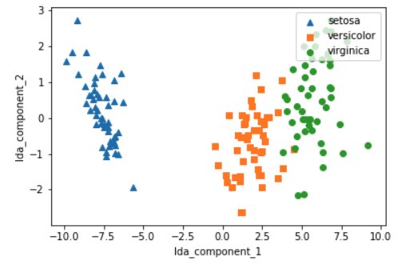

# 6장. 차원 축소

* [6.1. 차원 축소 개요](#6.1.)
* [6.2. PCA(Principal Component Analysis)](#6.2.)
* [6.3. LDA(Linear Discriminant Analysis)](#6.3.)
* [6.4. SVD(Singular Value Decomposition)](#6.4.)
* [6.5. NMF(Non-Negative Matrix Factorization)](#6.5.)

<br>

<div id='6.1.'/>

## 6.1. 차원 축소(Dimension Reduction) 개요

* 차원 축소는 매우 많은 피처로 구성된 다차원 데이터셋의 차원을 축소해 새로운 차원의 데이터셋을 생성하는 것이다.
* 일반적으로 차원이 증가할수록 데이터 포인트 간의 거리가 기하급수적으로 멀어지게 되고, 희소(spark)한 구조를 가지게 된다.
   * 피처가 많을 경우 개별 피처간에 상관관계가 높을 가능성이 크다.
   * 선형 모델에서는 입력 변수 간의 상관관계가 높을 경우 이로 인한 다중 공선성 문제로 모델의 예측 성능이 저하될 수 있다.
* 매우 많은 다차원의 피처를 차원 축소해 피처의 수를 줄이면 더 직관적으로 데이터를 해석할 수 있다.
   * 수십 개 이상의 피처가 있는 데이터의 경우 이를 시작적으로 표현해 데이터의 특성을 파악하기는 불가능하다.
      * 이 경우 2차원 혹은 3차원으로 차원 축소를 통해서 시각적으로 데이터를 압축해서 표현할 수 있다.
   * 또한, 차원 축소를 할 경우 학습 데이터의 메모리 크기가 줄어들어서 학습에 필요한 처리양도 줄일 수 있다.
<br>
   
* 차원 축소
   * 피처 선택(feature selection) or 특징 선택
      * 특정 피처에 종속성이 강한 불필요한 피처는 아예 제거하고, 데이터의 특징을 잘 나타내는 주요 피처만 선택하는 것이다.
      * 피처 추출은 기존 피처를 저차원의 중요 피처로 압축해서 추출하는 것이다.
      * 새롭게 추출된 중요 특성은 기존의 피처가 압축된 것으로 기존의 피처와는 완전히 다른 값이 된다.
   * 피처 추출(feature extraction)
      * 피처 추출은 기존 피처를 단순 압축이 아닌, 피처를 함축적으로 더 잘 설명할 수 있는 또 다른 공간으로 매핑해 추출하는 것이다.
      * 함축적인 특성 추출은 기존 피처가 전혀 인지하기 어려웠던 잠재적인 요소(Latent Factor)를 추출하는 것을 의미한다.
<br>  
      
* 차원 축소는 단순히 데이터의 압축을 의미하는 것은 아니다. 더 중요한 의미는 차원 축소를 통해 좀 더 데이터를 잘 설명할 수 있는 잠재적인 요소를 추출하는 데에 있다. (PCA, SVD, NMF, ...)
* 차원 축소를 통해 변환된 이미지는 원본 이미지보다 훨씬 적은 차원이기 때문에 이미지 분류 수행 시에 과적합(overfitting)의 영향력이 작아져서 오히려 원본 데이터로 예측하는 것보다 예측 성능을 더 끌어올릴 수 있다.
* 차원 축소를 통해 텍스트 문서의 숨겨진 의미를 추출할 수 있다. 차원 축소 알고리즘은 문서 내 단어들의 구성에서 숨겨져 있는 시맨틱(Semantic) 의미나 토픽(Topic)을 잠재 요소로 간주하고 이를 찾아낼 수 있다.

<br>

<div id='6.2.'/>

## 6.2. PCA(Principal Component Analysis)

* PCA는 여러 변수 간에 존재하는 상관관계를 이용해 이를 대표하는 주성분(Principal Component)을 추출해 차원을 축소하는 기법이다.
* PCA로 차원을 축소할 때는 기존 데이터의 정보 유실이 최소화되는 것이 당연하다.
* 이를 위해서 PCA는 가장 높은 분산을 가지는 데이터의 축을 찾아 이 축으로 차원을 축소하는데, 이것이 PCA의 주성분이 된다.(즉, 분산이 데이터의 특성을 가장 잘 나타내는 것으로 간주한다.)


* PCA를 먼저 개념적으로 살펴보면,
   * PCA는 제일 먼저 가장 큰 데이터 변동성(variance)을 기반으로 첫 번째 벡터 축을 생성하고, 
   * 두 번째 축은 이 벡터 축에 직각이 되는 벡터(직교 벡터)를 축으로 한다. 
   * 세 번째 축은 다시 두 번째 축과 직각이 되는 벡터를 설정하는 방식으로 축을 생성한다. 
   * 이렇게 생성된 벡터 축에 원본 데이터를 투영하면 벡터 축의 개수만큼의 차원으로 원본 데이터가 차원 축소된다.
* 주성분 분석(PCA)은 이처럼 원본 데이터의 피처 개수에 비해 매우 작은 주성분으로 원본 데이터의 총 변동성을 대부분 설명할 수 있는 분석법이다.


* 분산(varinace)은 평균을 기준으로 데이터가 흩어진 정도를 뜻한다. (느낌이 static하다)
* 공분산(covariance)은 두 변수 간의 방향적 관계를 뜻한다. 즉, x가 변할 때 y는 얼마나 변하는가. 동시성이 있다. (느낌이 Dynamic하다)
* 공분산을 이해할 때 일반적인 분산의 개념인 흩어진 정도로 이해하면 안된다.
<br>

* PCA를 선형대수 관점으로 해석하면,
   * 입력 데이터의 공분산 행렬(Covariance Matrix)을 고윳값 분해하고,
   * 이렇게 구한 고유벡터에 입력 데이터를 선형 변환하는 것이다.
   * 이 고유벡터가 PCA의 주성분 벡터로서 입력 데이터의 분산이 큰 방향을 나타낸다.
   * 고윳값(eigenvalue)은 바로 이 고유벡터의 크기를 나타내며, 동시에 입력 데이터의 분산을 나타낸다.
<br>

* 선형 변환
   * 특정 벡터에 행렬 A를 곱해 새로운 벡터로 변환하는 것을 의미한다.
   * 이를 특정 벡터를 하나의 공간에서 다른 공간으로 투영하는 개념으로 볼 수 있으며, 이 경우 이 행렬을 바로 공간으로 가정하는 것이다.
<br>
   
* 분산 - 한 개의 특정한 변수의 데이터 변동을 의미 (평균을 기준으로 데이터가 흩어진 정도)
* 공분산 - 두 변수 간의 변동을 의미 (한 변수가 변할 때 다른 변수가 변하는 정도)
* 공분산행렬 - 변수들의 모든 경우의 공분산을 포함하는 정방형 행렬
<br>

* 고유벡터
   * 행렬 A를 곱하더라도 방향이 변하지 않고 그 크기만 변하는 벡터를 지칭
   * Ax = ax 에서 A는 어떤 행렬, x는 고유벡터, a는 스칼라.
   * 고유벡터는 여러 개가 존재. 정방 행렬은 최대 그 차원 수만큼의 고유벡터를 가질 수 있음.
   * 이렇게 고유벡터는 행렬이 작용하는 힘의 방향과 관계가 있어서 행렬을 분해하는 데 사용된다.
<br>

* 공분산행렬은 정방행렬(Diagonal Matrix)이며 대칭행렬(Synmmetric Matrix)이다.
* 대칭행렬은 고윳값 분해와 관련해 매우 좋은 특성이 있다. 
* 대칭행렬은 항상 고유벡터를 직교행렬(orthogonal matrix)로, 고윳값을 정방행렬로 대각화할 수 있다.
* 공분산행렬을 C라고 하면, 공분산행렬의 특성으로 다음과 같이 분해할 수 있다.


* 공분산행렬 C는 고유벡터 직교행렬 * 고윳값 정방행렬 * 고유벡터 직교행렬의 전치행렬 로 분해된다.
* e_i는 i번째 고유벡터를, lambda_i는 i번째 고유벡터 크기를 의미한다.
* e_1은 분산이 가장 큰 방향을 가진 고유벡터이다.
<br>

* PCA 방식이란? 선형 변환 관점
   * 입력 데이터의 공분산행렬이 고유벡터와 고유값으로 분해될 수 있고
   * 이렇게 분해된 고유벡터를 이용해 입력 데이터를 선형 변환하는 방식이 PCA 방식이다.
<br>
   
* PCA 수행 과정
   1. 입력 데이터셋의 공분산행렬을 생성한다.
   2. 공분산행렬의 고유벡터와 고윳값을 계산한다.
   3. 고윳값이 가장 큰 순으로 K개(PCA 변환 차수만큼)만큼 고유벡터를 추출한다.
   4. 고유값이 가장 큰 순으로 추출된 고유벡터를 이용해 새롭게 입력데이터를 변환한다.


### iris 데이터 세트 PCA 변환


```python
from sklearn.datasets import load_iris
import pandas as pd
import matplotlib.pyplot as plt
%matplotlib inline

# 사이킷런 내장 데이터 셋 API 호출
iris = load_iris()

# 넘파이 데이터 셋을 Pandas DataFrame으로 변환
columns = ['sepal_length','sepal_width','petal_length','petal_width']
irisDF = pd.DataFrame(iris.data , columns=columns)
irisDF['target']=iris.target
print(irisDF.head(3))
```
```
   sepal_length  sepal_width  petal_length  petal_width  target
0           5.1          3.5           1.4          0.2       0
1           4.9          3.0           1.4          0.2       0
2           4.7          3.2           1.3          0.2       0
```

```python
#setosa는 세모, versicolor는 네모, virginica는 동그라미로 표현
markers=['^', 's', 'o']

#setosa의 target 값은 0, versicolor는 1, virginica는 2. 각 target 별로 다른 shape으로 scatter plot 
for i, marker in enumerate(markers):
    x_axis_data = irisDF[irisDF['target']==i]['sepal_length']
    y_axis_data = irisDF[irisDF['target']==i]['sepal_width']
    plt.scatter(x_axis_data, y_axis_data, marker=marker,label=iris.target_names[i])

plt.legend()
plt.xlabel('sepal length')
plt.ylabel('sepal width')
plt.show()
```


* 4개의 속성을 2개의 PCA 차원으로 압축해보자.
* 개별 속성을 스케일링하자. PCA는 여러 속성의 값을 연산해야 하므로 속성의 스케일에 영향을 받는다.


```python
from sklearn.preprocessing import StandardScaler

# Target 값을 제외한 모든 속성 값을 StandardScaler를 이용하여 표준 정규 분포를 가지는 값들로 변환
iris_scaled = StandardScaler().fit_transform(irisDF.iloc[:, :-1])

from sklearn.decomposition import PCA

pca = PCA(n_components=2)

#fit( )과 transform( ) 을 호출하여 PCA 변환 데이터 반환
pca.fit(iris_scaled)
iris_pca = pca.transform(iris_scaled)
print(iris_pca.shape)
```
```
(150, 2)
```

```python
# PCA 환된 데이터의 컬럼명을 각각 pca_component_1, pca_component_2로 명명
pca_columns=['pca_component_1','pca_component_2']
irisDF_pca = pd.DataFrame(iris_pca, columns=pca_columns)
irisDF_pca['target']=iris.target
print(irisDF_pca.head(3))
```
```
   pca_component_1  pca_component_2  target
0        -2.264703         0.480027       0
1        -2.080961        -0.674134       0
2        -2.364229        -0.341908       0
```

```python
#setosa를 세모, versicolor를 네모, virginica를 동그라미로 표시
markers=['^', 's', 'o']

#pca_component_1 을 x축, pc_component_2를 y축으로 scatter plot 수행. 
for i, marker in enumerate(markers):
    x_axis_data = irisDF_pca[irisDF_pca['target']==i]['pca_component_1']
    y_axis_data = irisDF_pca[irisDF_pca['target']==i]['pca_component_2']
    plt.scatter(x_axis_data, y_axis_data, marker=marker,label=iris.target_names[i])

plt.legend()
plt.xlabel('pca_component_1')
plt.ylabel('pca_component_2')
plt.show()
```


* PCA 객체의 explained_variance_ratio_ 함수는 전체 변동성에서 개별 PCA 컴포넌트별로 차지하는 변동성 비율을 제공한다.
* 아래 PCA를 2개 요소로만 변환해도 원본 데이터의 변동성을 95% 설명할 수 있다.


```python
print(pca.explained_variance_ratio_)
```
```
[0.72962445 0.22850762]
```

```python
from sklearn.ensemble import RandomForestClassifier
from sklearn.model_selection import cross_val_score
import numpy as np

rcf = RandomForestClassifier(random_state=156)
scores = cross_val_score(rcf, iris.data, iris.target,scoring='accuracy',cv=3)
print('원본 데이터 교차 검증 개별 정확도:',scores)
print('원본 데이터 평균 정확도:', np.mean(scores))
```
```
원본 데이터 교차 검증 개별 정확도: [0.98 0.94 0.96]
원본 데이터 평균 정확도: 0.96
```

* 10% 정확도 하락은 비교적 큰 성능 수치의 감소이지만, 속성의 개수가 4개에서 2개로 50% 감소한 것을 고려한다면 PCA 변환 후에도 원본 데이터의 특성을 상당 부분 유지하고 있음을 알 수 있다.

```python
pca_X = irisDF_pca[['pca_component_1', 'pca_component_2']]
scores_pca = cross_val_score(rcf, pca_X, iris.target, scoring='accuracy', cv=3 )
print('PCA 변환 데이터 교차 검증 개별 정확도:',scores_pca)
print('PCA 변환 데이터 평균 정확도:', np.mean(scores_pca))
```
```
PCA 변환 데이터 교차 검증 개별 정확도: [0.88 0.88 0.88]
PCA 변환 데이터 평균 정확도: 0.88
```

### 신용카드 고객 데이터 세트 PCA 변환

https://archive.ics.uci.edu/ml/datasets/default+of+credit+card+clients

```python
import pandas as pd

df = pd.read_excel('default of credit card clients.xls', sheet_name='Data')
print(df.shape)
print(df.head(3))
```
```
(30001, 25)
  Unnamed: 0         X1   X2         X3        X4   X5     X6     X7     X8  \
0         ID  LIMIT_BAL  SEX  EDUCATION  MARRIAGE  AGE  PAY_0  PAY_2  PAY_3   
1          1      20000    2          2         1   24      2      2     -1   
2          2     120000    2          2         2   26     -1      2      0   

      X9  ...        X15        X16        X17       X18       X19       X20  \
0  PAY_4  ...  BILL_AMT4  BILL_AMT5  BILL_AMT6  PAY_AMT1  PAY_AMT2  PAY_AMT3   
1     -1  ...          0          0          0         0       689         0   
2      0  ...       3272       3455       3261         0      1000      1000   

        X21       X22       X23                           Y  
0  PAY_AMT4  PAY_AMT5  PAY_AMT6  default payment next month  
1         0         0         0                           1  
2      1000         0      2000                           1  

[3 rows x 25 columns]
```

```python
# header로 의미없는 첫행 제거, iloc로 기존 id 제거
import pandas as pd

df = pd.read_excel('default of credit card clients.xls', header=1, sheet_name='Data').iloc[0:,1:]
print(df.shape)
print(df.head(3))
```
```
(30000, 24)
   LIMIT_BAL  SEX  EDUCATION  MARRIAGE  AGE  PAY_0  PAY_2  PAY_3  PAY_4  \
0      20000    2          2         1   24      2      2     -1     -1   
1     120000    2          2         2   26     -1      2      0      0   
2      90000    2          2         2   34      0      0      0      0   

   PAY_5  ...  BILL_AMT4  BILL_AMT5  BILL_AMT6  PAY_AMT1  PAY_AMT2  PAY_AMT3  \
0     -2  ...          0          0          0         0       689         0   
1      0  ...       3272       3455       3261         0      1000      1000   
2      0  ...      14331      14948      15549      1518      1500      1000   

   PAY_AMT4  PAY_AMT5  PAY_AMT6  default payment next month  
0         0         0         0                           1  
1      1000         0      2000                           1  
2      1000      1000      5000                           0  

[3 rows x 24 columns]
```

```python
df.rename(columns={'PAY_0':'PAY_1','default payment next month':'default'}, inplace=True)
y_target = df['default']
X_features = df.drop('default', axis=1)

X_features.info()
```
```
<class 'pandas.core.frame.DataFrame'>
RangeIndex: 30000 entries, 0 to 29999
Data columns (total 23 columns):
LIMIT_BAL    30000 non-null int64
SEX          30000 non-null int64
EDUCATION    30000 non-null int64
MARRIAGE     30000 non-null int64
AGE          30000 non-null int64
PAY_1        30000 non-null int64
PAY_2        30000 non-null int64
PAY_3        30000 non-null int64
PAY_4        30000 non-null int64
PAY_5        30000 non-null int64
PAY_6        30000 non-null int64
BILL_AMT1    30000 non-null int64
BILL_AMT2    30000 non-null int64
BILL_AMT3    30000 non-null int64
BILL_AMT4    30000 non-null int64
BILL_AMT5    30000 non-null int64
BILL_AMT6    30000 non-null int64
PAY_AMT1     30000 non-null int64
PAY_AMT2     30000 non-null int64
PAY_AMT3     30000 non-null int64
PAY_AMT4     30000 non-null int64
PAY_AMT5     30000 non-null int64
PAY_AMT6     30000 non-null int64
dtypes: int64(23)
memory usage: 5.3 MB
```

* 해당 데이터셋는 23개의 속성 데이터셋이 있으나 각 속성끼리 상관도가 매우 높다.

```python
import seaborn as sns
import matplotlib.pyplot as plt
%matplotlib inline

corr = X_features.corr()
plt.figure(figsize=(14,14))
sns.heatmap(corr, annot=True, fmt='.1g')
```


* BILL_AMT1 ~ BILL_AMT6 6개 속성끼리의 상관도가 대부분 0.9 이상으로 매우 높음을 알 수 있다.
* 이렇게 높은 상관도를 가진 속성들은 소수의 PCA만으로도 자연스럽게 이 속성들의 변동성을 수용할 수 있다.
* 다음 6개의 속성을 2개의 컴포넌트로 PCA 변환한 뒤 개별 컴포넌트의 변동성을 explained_variance_rtio_ 속성으로 알아보자.


```python
from sklearn.decomposition import PCA
from sklearn.preprocessing import StandardScaler

#BILL_AMT1 ~ BILL_AMT6 까지 6개의 속성명 생성
cols_bill = ['BILL_AMT'+str(i) for i in range(1,7)]
#cols_pay = ['PAY_' + str(i) for i in range(1, 7)]
#cols_amt = ['PAY_AMT' + str(i) for i in range(1, 7)]
print(cols_bill)
#cols_bill.extend(cols_pay)
#cols_bill.extend(cols_amt)
print('대상 속성명:',cols_bill)

# 2개의 PCA 속성을 가진 PCA 객체 생성하고, explained_variance_ratio_ 계산 위해 fit( ) 호출
scaler = StandardScaler()
df_cols_scaled = scaler.fit_transform(X_features[cols_bill])
X_features.loc[:, cols_bill] = df_cols_scaled
pca = PCA(n_components=2)
pca.fit(df_cols_scaled)
print('PCA Component별 변동성:', pca.explained_variance_ratio_)
```
```
['BILL_AMT1', 'BILL_AMT2', 'BILL_AMT3', 'BILL_AMT4', 'BILL_AMT5', 'BILL_AMT6']
대상 속성명: ['BILL_AMT1', 'BILL_AMT2', 'BILL_AMT3', 'BILL_AMT4', 'BILL_AMT5', 'BILL_AMT6']
PCA Component별 변동성: [0.90555253 0.0509867 ]
```


```python
import numpy as np
from sklearn.ensemble import RandomForestClassifier
from sklearn.model_selection import cross_val_score

rcf = RandomForestClassifier(n_estimators=300, random_state=156)
scores = cross_val_score(rcf, X_features, y_target, scoring='accuracy', cv=3)

print('CV=3 인 경우의 개별 Fold세트별 정확도:',scores)
print('평균 정확도:{0:.4f}'.format(np.mean(scores)))
```
```
CV=3 인 경우의 개별 Fold세트별 정확도: [0.8081 0.8197 0.8232]
평균 정확도:0.8170
```

* 23개 속성의 약 1/4 수준인 6개의 PCA 컴포넌트만으로도 원본 데이터를 기반으로 한 분류 예측 결과보다 약 1`~`2% 정도의 예측 성능 저하만 발생했다.

```python
from sklearn.decomposition import PCA
from sklearn.preprocessing import StandardScaler

# 원본 데이터셋에 먼저 StandardScaler적용
scaler = StandardScaler()
df_scaled = scaler.fit_transform(X_features)

# 6개의 Component를 가진 PCA 변환을 수행하고 cross_val_score( )로 분류 예측 수행. 
pca = PCA(n_components=6)
df_pca = pca.fit_transform(df_scaled)
scores_pca = cross_val_score(rcf, df_pca, y_target, scoring='accuracy', cv=3)

print('CV=3 인 경우의 PCA 변환된 개별 Fold세트별 정확도:',scores_pca)
print('PCA 변환 데이터 셋 평균 정확도:{0:.4f}'.format(np.mean(scores_pca)))
```
```
CV=3 인 경우의 PCA 변환된 개별 Fold세트별 정확도: [0.7921 0.7978 0.8017]
PCA 변환 데이터 셋 평균 정확도:0.7972
```

* PCA는 차원 축소를 통해 데이터를 쉽게 인지하는 데 활용될 수 있지만, 이보다 더 활발하게 적용되는 영역은 컴퓨터 비전 분야이다. 특히 얼굴 인식의 경우 Eigen-face라고 불리는 PCA 변환으로 원본 얼굴 이미지를 변환해 사용하는 경우가 많다.

<br>

<div id='6.3.'/>

## 6.3. LDA (Linear Discriminant Analysis)

* LDA(Linear Discriminant Analysis)는 선형 판별 분석법으로 불리며, PCA와 매우 유사하다.
* PCA와 유사하게 입력 데이터셋을 저차원 공간에 투영해 차원을 축소하는 기법이지만, 중요한 차이는 LDA는 지도학습의 분류에서 사용하기 쉽도록 개별 클래스를 분별할 수 있는 기준을 최대한 유지하면서 차원을 축소한다.
* PCA는 입력 데이터의 변동성의 가장 큰 축을 찾았지만, LDA는 입력 데이터의 결정 값 클래스를 최대한으로 분리할 수 있는 축을 찾는다.
* LDA는 특정 공간상에서 클래스 분리를 최대화하는 축을 찾기 위해 클래스 간 분산(between-class scatter)과 클래스 내부 분산(within-class scatter)의 비율을 최대화하는 방식으로 차원을 축소한다.
* 즉, 클래스 간 분산은 최대한 크게 가져가고, 클래스 내부의 분산은 최대한 작게 가져가는 방식이다.
* 다음 그림은 좋은 클래스 분리를 위해 클래스 간 분산이 크고 클래스 내부 분산이 작은 것을 표현한 것이다.


* 일반적으로 LDA를 구하는 스텝은 PCA와 유사하나 가장 큰 차이점은 공분산 행렬이 아니라 위에 설명한 클래스 간 분산과 클래스 내부 분산 행렬을 생성한 뒤, 이 행렬에 기반해 고유벡터를 구하고 입력 데이터를 투영한다는 점이다.
<br>

* LDA 수행 과정
   1. 클래스 내부와 클래스 간 분산 행렬을 구한다. 이 두 개의 행렬은 입력 데이터의 결정 값 클래스별로 개별 피처의 평균 벡터(mean vector)를 기반으로 구한다.
   2. 클래스 내부 분산 행렬을 S_W, 클래스 간 분산 행렬을 S_B 라고 하면 다음 식(아래 그림)으로 두 행렬을 고유벡터로 분해할 수 있다.
   3. 고유값이 가장 큰 순으로 K개(LDA변환 차수만큼) 추출한다.
   4. 고유값이 가장 큰 순으로 추출된 고유벡터를 이용해 새롭게 입력 데이터를 변환한다.


### iris 데이터셋에 LDA 적용하기

```python
from sklearn.discriminant_analysis import LinearDiscriminantAnalysis
from sklearn.preprocessing import StandardScaler
from sklearn.datasets import load_iris

iris = load_iris()
iris_scaled = StandardScaler().fit_transform(iris.data)
```

* LDA는 PCA와 다르게 비지도학습이 아닌 지도학습이다. (iris_scaled, iris.target 모두 사용)

```python
lda = LinearDiscriminantAnalysis(n_components=2)
lda.fit(iris_scaled, iris.target)
iris_lda = lda.transform(iris_scaled)
print(iris_lda.shape)
```
```
(150, 2)
```

```python
import pandas as pd
import matplotlib.pyplot as plt
%matplotlib inline

lda_columns=['lda_component_1','lda_component_2']
irisDF_lda = pd.DataFrame(iris_lda,columns=lda_columns)
irisDF_lda['target']=iris.target

#setosa는 세모, versicolor는 네모, virginica는 동그라미로 표현
markers=['^', 's', 'o']

#setosa의 target 값은 0, versicolor는 1, virginica는 2. 각 target 별로 다른 shape으로 scatter plot
for i, marker in enumerate(markers):
    x_axis_data = irisDF_lda[irisDF_lda['target']==i]['lda_component_1']
    y_axis_data = irisDF_lda[irisDF_lda['target']==i]['lda_component_2']

    plt.scatter(x_axis_data, y_axis_data, marker=marker,label=iris.target_names[i])

plt.legend(loc='upper right')
plt.xlabel('lda_component_1')
plt.ylabel('lda_component_2')
plt.show()
```



<br>

<div id='6.4.'/>

## 6.4. SVD(Singular Value Decomposition)

* SVD 역시 PCA와 유사한 행렬 분해 기법을 사용한다.
* PCA의 경우 정방행렬만을 고유벡터로 분해할 수 있지만, SVD는 정방행렬뿐만 아니라 행과 열의 크기가 다른 행렬에도 적용할 수 있다.
* 일반적으로 SVD는 m x n 크기의 행렬 A를 다음과 같이 분해하는 것을 의미한다.


* SVD는 특이값 분해로 불리며, 행렬 U와 V에 속한 벡터는 특이벡터(singular vector)이며, 모든 특이벡터는 서로 직교하는 성질을 가진다.
* 가운데는 대각행렬이며, 행렬의 대각에 위치한 값만 0이 아니고 나머지는 모두 0이다.
* 가운데의 대각 값들이 바로 행렬 A의 특이값이다.
* 다음과 같이 SVD는 A의 차원이 m x n일 때, U의 차원이 m x m, 가운데 대각행렬의 차원이 m x n, 그리고 V^T의 차원이 n x n 으로 분해된다.


* 일반적으로 다음과 같이 가운데 대각행렬의 비대각 부분과 대각원소 중에 특이값이 0인 부분도 모두 제거하고 제거된 가운데 대각행렬에 대응되는 U와 V 원소도 함께 제거해 차원을 줄인 형태로 SVD를 적용한다.
* 이렇게 컴팩트한 형태로 SVD를 적용하면 A의 차원이 m x n일 때, U의 차원을 m x p, 가운데 대각행렬의 차원을 p x p, V^T의 차원을  p x n으로 분해한다.


* Truncated SVD는 가운데 대각행렬의 대각원소 중에 상위 몇 개만 추출해서 여기에 대응하는 U와 V의 원소도 함께 제거해 더욱 차원을 줄인 형태로 분해하는 것이다.

### 랜덤 데이터 SVD 적용

* 랜덤 행렬을 생성하는 이유는 행렬의 개별 로우끼리의 의존성을 없애기 위해서이다.

```python
# numpy의 svd 모듈 import
import numpy as np
from numpy.linalg import svd

# 4X4 Random 행렬 a 생성(정방행렬)
np.random.seed(121)
a = np.random.randn(4,4)
print(np.round(a, 3))
```
```
[[-0.212 -0.285 -0.574 -0.44 ]
 [-0.33   1.184  1.615  0.367]
 [-0.014  0.63   1.71  -1.327]
 [ 0.402 -0.191  1.404 -1.969]]
```

```python
U, Sigma, Vt = svd(a)
print(U.shape, Sigma.shape, Vt.shape)
print('U matrix:\n',np.round(U, 3))
print('Sigma Value:\n',np.round(Sigma, 3))
print('V transpose matrix:\n',np.round(Vt, 3))
```
```
(4, 4) (4,) (4, 4)
U matrix:
 [[-0.079 -0.318  0.867  0.376]
 [ 0.383  0.787  0.12   0.469]
 [ 0.656  0.022  0.357 -0.664]
 [ 0.645 -0.529 -0.328  0.444]]
Sigma Value:
 [3.423 2.023 0.463 0.079]
V transpose matrix:
 [[ 0.041  0.224  0.786 -0.574]
 [-0.2    0.562  0.37   0.712]
 [-0.778  0.395 -0.333 -0.357]
 [-0.593 -0.692  0.366  0.189]]
```

* 가운데 대각행렬의 경우 행렬의 대각에 위치한 값만 0이 아니고, 그렇지 않은 경우는 모두 0이므로 0이 아닌 값의 경우만 1차원 행렬로 표현한다.
* 벡터를 행렬로 바꿔주자.
* 세 가지 행렬 연산의 결과가 원본 행렬이 나타나는 것을 알 수 있다.

```python
# Sigma를 다시 0 을 포함한 대칭행렬로 변환
Sigma_mat = np.diag(Sigma)

# 행렬 곱셈 연산
a_ = np.dot(np.dot(U, Sigma_mat), Vt)
print(np.round(a_, 3))
```
```
[[-0.212 -0.285 -0.574 -0.44 ]
 [-0.33   1.184  1.615  0.367]
 [-0.014  0.63   1.71  -1.327]
 [ 0.402 -0.191  1.404 -1.969]]
```

* 이번에는 데이터셋이 로우 간의 의존성이 있는 경우에 어떻게 Sigma 값이 변하고, 이에 따른 차원 축소가 진행되는지 알아보자.
* 일부러 의존성을 부여하기 위해 a 행렬의 3번째 로우를 '첫 번째 로우 + 두 번째 로우'로 업데이트하고, 4번째 로우는 첫 번째 로우와 같다고 업데이트하자.
* 이제 a 행렬은 이전과 다르게 로우 간 의존관계가 매우 높아졌다. 
* 이 데이터를 SVD로 다시 분해해보자.

```python
a[2] = a[0] + a[1]
a[3] = a[0]
print(np.round(a,3))
```
```
[[-0.212 -0.285 -0.574 -0.44 ]
 [-0.33   1.184  1.615  0.367]
 [-0.542  0.899  1.041 -0.073]
 [-0.212 -0.285 -0.574 -0.44 ]]
```

* 이전과 차원은 같지만 Sigma 값 중 2개가 0으로 변했다. 즉, 선형 독립인 로우 벡터의 개수가 2개라는 의미이다. (즉, 행렬의 rank가 2이다)

```python
# 다시 SVD를 수행하여 Sigma 값 확인 
U, Sigma, Vt = svd(a)
print(U.shape, Sigma.shape, Vt.shape)
print('Sigma Value:\n',np.round(Sigma,3))
```
```
(4, 4) (4,) (4, 4)
Sigma Value:
 [2.663 0.807 0.    0.   ]
```

* 원본 행렬로 복원해보자.

```python
# U 행렬의 경우는 Sigma와 내적을 수행하므로 Sigma의 앞 2행에 대응되는 앞 2열만 추출
U_ = U[:, :2]
Sigma_ = np.diag(Sigma[:2])
# V 전치 행렬의 경우는 앞 2행만 추출
Vt_ = Vt[:2]
print(U_.shape, Sigma_.shape, Vt_.shape)
# U, Sigma, Vt의 내적을 수행하며, 다시 원본 행렬 복원
a_ = np.dot(np.dot(U_,Sigma_), Vt_)
print(np.round(a_, 3))
```
```
(4, 2) (2, 2) (2, 4)
[[-0.212 -0.285 -0.574 -0.44 ]
 [-0.33   1.184  1.615  0.367]
 [-0.542  0.899  1.041 -0.073]
 [-0.212 -0.285 -0.574 -0.44 ]]
```

### Truncated SVD 를 이용한 행렬 분해

* Truncated SVD는 가운데 대각행렬에 있는 대각원소, 즉 특이값 중 상위 일부 데이터만 추출해 분해하는 방식이다.
* 이렇게 분해하면 인위적으로 더 작은 차원의 행렬들로 분해되기 때문에 원본 행렬을 정확하게 다시 원복할 수는 없다.
* 하지만, 데이터 정보가 압축되어 분해됨에도 불구하고 상당한 수준으로 원본 행렬을 근사할 수 있다.
<br>

* Truncated SVD는 넘파이가 아닌 사이파이에서만 지원된다.
* 사이파이는 SVD뿐만 아니라 Truncated SVD도 지원한다.
* 사이파이의 SVD는 scipy.linalg.svd를 이용하면 되지만, Truncated SVD는 희소행렬만 지원되기 때문에 scipy.sparse.linalg.svds를 사용해야 한다.

```python
import numpy as np
from scipy.sparse.linalg import svds
from scipy.linalg import svd

# 원본 행렬을 출력하고, SVD를 적용할 경우 U, Sigma, Vt 의 차원 확인 
np.random.seed(121)
matrix = np.random.random((6, 6))
print('원본 행렬:\n',matrix)
U, Sigma, Vt = svd(matrix, full_matrices=False)
print('\n분해 행렬 차원:',U.shape, Sigma.shape, Vt.shape)
print('\nSigma값 행렬:', Sigma)

# Truncated SVD로 Sigma 행렬의 특이값을 4개로 하여 Truncated SVD 수행. 
num_components = 4
U_tr, Sigma_tr, Vt_tr = svds(matrix, k=num_components)
print('\nTruncated SVD 분해 행렬 차원:',U_tr.shape, Sigma_tr.shape, Vt_tr.shape)
print('\nTruncated SVD Sigma값 행렬:', Sigma_tr)
matrix_tr = np.dot(np.dot(U_tr,np.diag(Sigma_tr)), Vt_tr)  # output of TruncatedSVD

print('\nTruncated SVD로 분해 후 복원 행렬:\n', matrix_tr)
```
```
원본 행렬:
 [[0.11133083 0.21076757 0.23296249 0.15194456 0.83017814 0.40791941]
 [0.5557906  0.74552394 0.24849976 0.9686594  0.95268418 0.48984885]
 [0.01829731 0.85760612 0.40493829 0.62247394 0.29537149 0.92958852]
 [0.4056155  0.56730065 0.24575605 0.22573721 0.03827786 0.58098021]
 [0.82925331 0.77326256 0.94693849 0.73632338 0.67328275 0.74517176]
 [0.51161442 0.46920965 0.6439515  0.82081228 0.14548493 0.01806415]]

분해 행렬 차원: (6, 6) (6,) (6, 6)

Sigma값 행렬: [3.2535007  0.88116505 0.83865238 0.55463089 0.35834824 0.0349925 ]

Truncated SVD 분해 행렬 차원: (6, 4) (4,) (4, 6)

Truncated SVD Sigma값 행렬: [0.55463089 0.83865238 0.88116505 3.2535007 ]

Truncated SVD로 분해 후 복원 행렬:
 [[0.19222941 0.21792946 0.15951023 0.14084013 0.81641405 0.42533093]
 [0.44874275 0.72204422 0.34594106 0.99148577 0.96866325 0.4754868 ]
 [0.12656662 0.88860729 0.30625735 0.59517439 0.28036734 0.93961948]
 [0.23989012 0.51026588 0.39697353 0.27308905 0.05971563 0.57156395]
 [0.83806144 0.78847467 0.93868685 0.72673231 0.6740867  0.73812389]
 [0.59726589 0.47953891 0.56613544 0.80746028 0.13135039 0.03479656]]
```

* Truncated SVD를 복원하면 근사적으로 복원되는 것을 알 수 있다.

#### 사이킷런 TruncatedSVD 클래스를 이용한 변환

* 사이킷런의 TruncatedSVD 클래스는 사이파이의 svds와 같이 Truncated SVD 연산을 수행해 원본 행렬을 분해한 U, Sigma, Vt 행렬을 반환하지는 않는다.
* 원본 데이터를 Truncated SVD 방식으로 분해된 U * Sigma 행렬에 선형 변환해 생성한다.

```python
from sklearn.decomposition import TruncatedSVD, PCA
from sklearn.datasets import load_iris
import matplotlib.pyplot as plt
%matplotlib inline

iris = load_iris()
iris_ftrs = iris.data
# 2개의 주요 component로 TruncatedSVD 변환
tsvd = TruncatedSVD(n_components=2)
tsvd.fit(iris_ftrs)
iris_tsvd = tsvd.transform(iris_ftrs)

# Scatter plot 2차원으로 TruncatedSVD 변환 된 데이터 표현. 품종은 색깔로 구분
plt.scatter(x=iris_tsvd[:,0], y= iris_tsvd[:,1], c= iris.target)
plt.xlabel('TruncatedSVD Component 1')
plt.ylabel('TruncatedSVD Component 2')
```


* 사이킷런의 TruncatedSVD와 PCA 클래스 구현을 자세히 들여다보면 두 개 클래스 모두 SVD를 이용해 행렬을 분해한다.
* iris 데이터를 스케일링으로 변환한 뒤에 TruncatedSVD와 PCA 클래스 변환을 해보면 두 개가 거의 동일함을 알 수 있다.

```python
from sklearn.preprocessing import StandardScaler

# iris 데이터를 StandardScaler로 변환
scaler = StandardScaler()
iris_scaled = scaler.fit_transform(iris_ftrs)

# 스케일링된 데이터를 기반으로 TruncatedSVD 변환 수행 
tsvd = TruncatedSVD(n_components=2)
tsvd.fit(iris_scaled)
iris_tsvd = tsvd.transform(iris_scaled)

# 스케일링된 데이터를 기반으로 PCA 변환 수행 
pca = PCA(n_components=2)
pca.fit(iris_scaled)
iris_pca = pca.transform(iris_scaled)

# TruncatedSVD 변환 데이터를 왼쪽에, PCA변환 데이터를 오른쪽에 표현 
fig, (ax1, ax2) = plt.subplots(figsize=(9,4), ncols=2)
ax1.scatter(x=iris_tsvd[:,0], y= iris_tsvd[:,1], c= iris.target)
ax2.scatter(x=iris_pca[:,0], y= iris_pca[:,1], c= iris.target)
ax1.set_title('Truncated SVD Transformed')
ax2.set_title('PCA Transformed')
```


<br>

<div id='6.5.'/>

## 6.5. NMF(Non-Negative Matrix Factorization)

* NMF는 Truncated SVD와 같이 낮은 랭크를 통한 행렬 근사(Low-Rank Approximation) 방식의 변형이다.
* NMF는 원본 행렬 내의 모든 원소 값이 양수가 보장되면 다음과 같이 좀 더 간단하게 두 개의 양수 행렬로 분햏될 수 있는 기법을 말한다.


* 4 x 6 원본 행렬 V는 4 x 2 행렬 W와 2 x 6 행렬 H로 근사해 분해될 수 있다.
* 행렬 분해(Matrix Factorization)는 일반적으로 SVD와 같은 행렬 분해 기법을 통칭하는 것이다.
* 분해된 V와 W 행렬은 잠재 요소(Latent Factor)를 특성으로 가지게 된다.
* 분해 행렬 W는 원본 행에 대해서 이 잠재 요소의 값이 얼마나 되는지에 대응하며, 분해 행렬 H는 이 잠재 요소가 원본 열(즉, 원본 속성)로 어떻게 구성되는지를 나타내는 행렬이다.


* NMF는 SVD와 유사하게 차원 축소를 통한 잠재 요소 도출로 이미지 변환 및 압축, 텍스트의 토픽 도출 등의 영역에서 사용되고 있다.
* 사이킷런에서 NMF는 NMF 클래스를 이용해 지원된다.

### iris 데이터셋에 NMF 적용

```python
from sklearn.decomposition import NMF
from sklearn.datasets import load_iris
import matplotlib.pyplot as plt
%matplotlib inline

iris = load_iris()
iris_ftrs = iris.data
nmf = NMF(n_components=2)
nmf.fit(iris_ftrs)
iris_nmf = nmf.transform(iris_ftrs)
plt.scatter(x=iris_nmf[:,0], y= iris_nmf[:,1], c= iris.target)
plt.xlabel('NMF Component 1')
plt.ylabel('NMF Component 2')
```


* NMF도 SVD와 유사하게 이미지 압축을 통한 패턴 인식, 텍스트의 토픽 모델링 기법, 문서 유사도 및 클러스터링에 잘 사용된다.
* 영화 추천과 같은 추천(Recommendations) 영역에 활발하게 적용된다.
   * 사용자의 상품(영화) 평가 데이터셋인 사용자-평가순위(User-Rating) 데이터셋을 행렬 분해 기법을 통해 분해하면서
   * 사용자가 평가하지 않은 상품에 대한 잠재적인 요소를 추출해 이를 통해 평가순위(Rating)을 예측하고,
   * 높은 순위로 예측된 상품을 추천해주는 방식이다.
   * 이를 잠재 요소(Latent Factoring) 기반의 추천 방식이라 한다.

