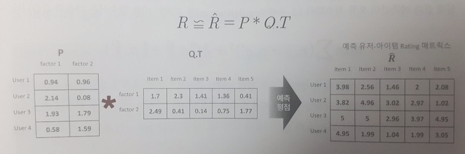

<div id='top.'/>

# 9장. 추천 시스템

* [9.1. 추천 시스템 개요 및 배경](#9.1.)
* [9.2. 콘텐츠 기반 필터링 추천 시스템](#9.2.)
* [9.3. 최근접 이웃 협업 필터링](#9.3.)
* [9.4. 잠재 요인 협업 필터링](#9.4.)
* [9.5. 콘텐츠 기반 필터링 실습 - TMDB 5000 영화 데이터셋](#9.5.)
* [9.6. 아이템 기반 최근접 이웃 협업 필터링 실습](#9.6.)
* [9.7. 행렬 분해를 이용한 잠재 요인 협업 필터링 실습](#9.7.)
* [9.8. 파이썬 추천 시스템 패키지 - Surprise](#9.8.)

<br>

<div id='9.1.'/>

## 9.1. 추천 시스템 개요 및 배경

### 추천 시스템 유형

* 추천 시스템
   * 콘텐츠 기반 필터링(Content based filtering)
   * 협업 필터링(Collaborative Filtering)
      * 최근접 이웃(Nearest Neighbor) 협업 필터링
      * 잠재 요인(Latent Factor) 협업 필터링
<br>

* 추천 시스템의 초창기에는 콘텐츠 기반 필터링이나 최근접 이웃 기반 협업 필터링이 주로 사용되었지만, 넷플릭스 추천 시스템 경연 대회에서 행렬 분해(Matrix Factorization) 기법을 이용한 잠재 요인 협업 필터링 방식이 우승하면서 대부분의 온라인 스토어에서 잠재 요인 협업 필터링 기반의 추천 시스템을 적용하고 있다.
* 서비스하는 아이템의 특성에 따라 콘텐츠 기반 필터링이나 최근접 이웃 기반 협업 필터링 방식을 유지하는 사이트도 많다. (ex. 아마존)
* 개인화 특성을 좀 더 강화하기 위해서 하이브리드 형식으로 콘텐츠 기반과 협업 기반을 적절히 결합해 사용하는 경우도 늘고 있다.

<br>

<div id='9.2.'/>

## 9.2. 콘텐츠 기반 필터링 추천 시스템

* 사용자가 특정한 아이템을 매우 선호(high rating)하는 경우 해당 아이템과 비슷한 콘텐츠를 가진 다른 아이템을 추천
   * 아이템: 장르, 배우, 감독, 영화 키워드, ...
* 영화의 콘텐츠가 포함될 수 있는 벡터를 일일이 만들어야 한다.

<br>

<div id='9.3.'/>

## 9.3. 최근접 이웃 협업 필터링

* 협업 필터링
   * 사용자가 아이템에 매긴 평점 정보나 상품 구매 이력과 같은 사용자 행동 양식(User Behavior)만을 기반으로 추천을 수행
   * 사용자-아이템 평점 매트릭스와 같은 추적된 사용자 행동 데이터를 기반으로 사용자가 아직 평가하지 않은 아이템을 예측 평가하는 것
   


* 협업 필터링
   * (1) 최근접 이웃 방식 과 (2) 잠재 요인 방식 로 구분됨.
   * 두 방식 모두 사용자-아이템 평점 행렬 데이터에만 의지해 추천을 수행함.
<br>

* 협업 필터링을 수행하기 위해 아래와 같이 사용자-아이템 평점 행렬를 구성해야 함.


* 이러한 사용자-아이템 평점 행렬은 희소 행렬(sparse matrix) 특성을 가짐.
* 최근접 이웃 협업 필터링은 메모리(Memory) 협업 필터링이라고도 한다.
* 최근접 이웃 협업 필터링
   * 사용자 기반(User-user)
      * 당신과 비슷한 고객들이 다음 상품도 구매했습니다(Customers like you also bought these items)
      * 사용자 벡터 유사도
   * 아이템 기반(Item-item)
      * 이 상품을 선택한 다른 고객들은 다음 상품도 구매했습니다(Customers who bought this item also bought these items)
      * 아이템 벡터 유사도
<br>
   
* 사용자 기반 최근접 이웃 방식은 특정 사용자와 유사한 다른 사용자를 Top-N으로 선정해 이 Top-N 사용자가 좋아하는 아이템을 추천하는 방식이다.
   * 즉, 특정 사용자와 타 사용자 간의 유사도(similarity)를 측정한 뒤 가장 유사도가 높은 Top-N 사용자를 추출해 그들이 선호하는 아이템을 추천하는 것이다.
   


* 아이템 기반 최근접 이웃 방식은 아이템이 가지는 속성과는 상관없이 사용자들이 그 아이템을 좋아하는지/싫어하는지의 평가 척도가 유사한 아이템을 추천하는 기준이되는 알고리즘이다.
* 위의 그림과 비교했을 때, 다음 그림에서 축이 바뀐 것을 유념하자.


* 일반적으로 사용자 기반보다는 아이템 기반 협업 필터링의 정확도가 더 높다.
   * 비슷한 영화(또는 상품)를 좋아(또는 구입)한다고 해서 사람들의 취향이 비슷하다고 판단하기에 어려운 경우가 많다.
   * 매우 유명한 영화는 취향과 관계없이 대부분 사람이 관람하는 경우가 많다.
   * 사용자들이 평점이 매긴 영화의 개수가 많지 않은 경우가 대부분이다.
   * 사람의 취향으로 벡터 유사도 측정이 어려울 것이다. (더 깊은 분석이 필요하다)
   * 반면, 영화 분석 벡터 유사도는 조금 더 쉬울 것이다.
* 추천 시스템에 사용되는 피처 벡터는 텍스트 피처 벡터와 동일하게 다차원 희소 행렬이므로 유사도 측정을 위해 주로 코사인 유사도를 이용한다.

<br>

<div id='9.4.'/>

## 9.4. 잠재 요인 협업 필터링

* 잠재 요인 협업 필터링은 사용자-아이템 평점 행렬 속에 숨어 있는 잠재 요인을 추출해 추천 예측을 하는 기법이다.
* 대규모 다차원 행렬을 SVD와 같은 차원 감소 기법으로 분해하는 과정에서 잠재 요인을 추출한다. 이러한 기법을 행렬 분해(Matrix Factorization)이라 한다.
* 넷플릭스 경연 대회에서 우승한 모델은 행렬 분해 기반의 여러 모델을 결합해 만든 모델이다.
* 행렬 분해로 분해된 두 행렬의 내적을 통해 새로운 예측 사용자-아이템 평점 행렬을 만들 수 있다.


* 행렬 분해에 의해 추출되는 '잠재 요인'이 정확히 어떤 것인지는 알 수 없지만, 영화 평점 기반의 사용자-아이템 평점 행렬 데이터라면 영화가 가지는 장르별 특성 선호도로 가정할 수 있다.
   * 사용자-잠재 요인 행렬은 사용자의 영화 장르에 대한 선호도
   * 아이템-잠재 요인 행렬은 영화의 장르별 특성값
<br>

* 다음 그림에서 factor1과 factor2를 각각 Action과 Romance로 가정한다.


* 평점이란 사용자의 특정 영화 장르에 대한 선호도와 개별 영화의 그 장르적 특성값을 반영해 결정된다고 생각할 수 있다.
* 예를 들어, 사용자가 액션 영화를 매우 좋아하고, 특정 영화가 액션 영화의 특성이 매우 크다면 사용자가 해당 영화에 높은 평점을 줄 것이다.
* 따라서, 평점은 사용자의 장르별 선호도 벡터와 영화의 장르별 특성 벡터를 서로 곱해서 만들 수 있다.



* 이처럼 잠재 요인 협업 필터링은 숨겨져 있는 '잠재 요인'을 기반으로 분해된 매트릭스를 이용해 사용자가 아직 평가하지 않은 아이템에 대한 예측 평가를 수행하는 것이다.

### 행렬 분해의 이해

* 행렬 분해는 다차원의 매트릭스를 저차원의 매트릭스로 분해하는 기법으로 대표적으로 SVD(Singular Vector Decomposition), NMF(Non-Negative Matrix Factorization) 등이 있다.
* Factorization(분해)는 '인수분해'를 말한다. 인수분해는 하나의 복잡한 다항식을 두 개 이상의 좀 더 단순한 인수(factor)의 곱으로 분해하는 것을 말한다. (ex. x2 + 5x + 6 = (x+2)(x+3)) 행렬 분해도 이와 다르지 않다. 단, 행렬이므로 훨씬 더 복잡하다.


* 사용자-아이템 평점 행렬의 미정 값을 포함한 모든 평점 값은 행렬 분해로 얻어진 P 행렬과 Q.T 행렬의 내적을 통해 예측 평점으로 다시 계산할 수 있다.


* 그렇다면 R 행렬을 P 와 Q 행렬로 분해하는 방법은 주로 SVD(Singular Value Decomposition) 방식을 이용한다.
* 하지만, SVD는 null 값이 없는 행렬에만 적용할 수 있으므로, 대부분의 null 값이 있는 사용자-아이템 평점 행렬에 적용할 수 없다.
   * SVD에 돌리기 전에 0을 근사값으로 채우면 되지 않나?
* 이러한 경우는 확률적 경사 하강법(Stochastic Gradient Descent, SGD)나 ALS(Alternating Least Sqaures) 방식을 이용해 SVD를 수행한다.
   * SGD를 만든다는 것은 그냥 분류 문제로 만드는 것과 같다.

### 확률적 경사 하강법(SGD)을 이용한 행렬 분해

* P 와 Q 행렬로 계산된 예측 R 행렬 값이 실제 R 행렬 값과 비교했을 때 최소의 오류를 가질 수 있도록 반복적인 최적화를 통해 P 와 Q를 유추해내는 것이다.
* SGD를 이용한 행렬 분해 과정
   1. P와 Q행렬을 임의의 값으로 초기화한다.
   2. P와 Q.T값을 곱해 예측 R행렬을 계산하고 예측 R행렬과 실제R행렬을 비교해 오류 값을 계산한다.
   3. 오류 값을 최소화하는 방향으로 P와 Q행렬을 업데이트한다.
   4. 오류 값이 일정 수준으로 수렴할 때까지 2, 3번 작업을 반복한다.
<br>

* 실제 값과 예측값의 오류를 최소화하고 L2 규제가 포함된 비용 함수식은 다음과 같다.


* 위 비용 함수식을 기반으로 업데이트되는 P행렬과 Q행렬은 다음과 같다. (p와 q는 벡터)
   * p와 q는 벡터이다. 벡터 단위로 업데이트된다. 하지만, 실제 업데이트되는 값은 하나의 평점 scalar 값이다.
   * 즉, 하나의 평점에 의해 p와 q 벡터가 업데이트된다.
   * 미분을 하면, p 기준에서는 q가, q 기준에서는 p가 떨어지기 때문에 아래의 업데이트 함수 식이 나온다.
   * p와 q를 동시에 업데이트하나? 번갈아가면서 해야되지 않나?


* L2 규제를 반영해 실제 R 행렬 값과 예측 R행렬 값의 차이를 최소화하는 방향성을 가지고 P행렬과 Q행렬에 업데이트를 반복적으로 수행하면서 최적화된 예측 R행렬을 구하는 방식이 SGD 기반의 행렬 분해이다.

<br>

* 예제를 살펴보자.
   * 원본 행렬 R은 임의의 값으로 초기화
   * P와 Q 행렬은 랜덤 값으로 초기화

```python
import numpy as np

# 원본 행렬 R 생성, 분해 행렬 P와 Q 초기화, 잠재요인 차원 K는 3 설정. 
R = np.array([[4, np.NaN, np.NaN, 2, np.NaN ],
              [np.NaN, 5, np.NaN, 3, 1 ],
              [np.NaN, np.NaN, 3, 4, 4 ],
              [5, 2, 1, 2, np.NaN ]])
num_users, num_items = R.shape
K=3

# P와 Q 매트릭스의 크기를 지정하고 정규분포를 가진 random한 값으로 입력합니다. 
np.random.seed(1)
P = np.random.normal(scale=1./K, size=(num_users, K))
Q = np.random.normal(scale=1./K, size=(num_items, K))

from sklearn.metrics import mean_squared_error

def get_rmse(R, P, Q, non_zeros):
    error = 0
    # 두개의 분해된 행렬 P와 Q.T의 내적으로 예측 R 행렬 생성
    full_pred_matrix = np.dot(P, Q.T)
    
    # 실제 R 행렬에서 널이 아닌 값의 위치 인덱스 추출하여 실제 R 행렬과 예측 행렬의 RMSE 추출
    x_non_zero_ind = [non_zero[0] for non_zero in non_zeros]
    y_non_zero_ind = [non_zero[1] for non_zero in non_zeros]
    R_non_zeros = R[x_non_zero_ind, y_non_zero_ind]
    full_pred_matrix_non_zeros = full_pred_matrix[x_non_zero_ind, y_non_zero_ind]
      
    mse = mean_squared_error(R_non_zeros, full_pred_matrix_non_zeros)
    rmse = np.sqrt(mse)
    
    return rmse
```

* 여기서는 p와 q 벡터를 동시에 업데이트하네. 번갈아가면서 하면 좀 더 최적화가 잘 되지 않을까?
* 복잡한 행렬, null 값이 많을수록 더 효율적인 최적화 방법이 필요할 것이다.

```python
# R > 0 인 행 위치, 열 위치, 값을 non_zeros 리스트에 저장. 
non_zeros = [ (i, j, R[i,j]) for i in range(num_users) for j in range(num_items) if R[i,j] > 0 ]

steps=1000
learning_rate=0.01
r_lambda=0.01

# SGD 기법으로 P와 Q 매트릭스를 계속 업데이트. 
for step in range(steps):
    for i, j, r in non_zeros:
        # 실제 값과 예측 값의 차이인 오류 값 구함
        eij = r - np.dot(P[i, :], Q[j, :].T)
        # Regularization을 반영한 SGD 업데이트 공식 적용
        P[i,:] = P[i,:] + learning_rate*(eij * Q[j, :] - r_lambda*P[i,:])
        Q[j,:] = Q[j,:] + learning_rate*(eij * P[i, :] - r_lambda*Q[j,:])

    rmse = get_rmse(R, P, Q, non_zeros)
    if (step % 50) == 0 :
        print("### iteration step : ", step," rmse : ", rmse)
```
```
### iteration step :  0  rmse :  3.2388050277987723
### iteration step :  50  rmse :  0.4876723101369648
### iteration step :  100  rmse :  0.1564340384819247
### iteration step :  150  rmse :  0.07455141311978046
### iteration step :  200  rmse :  0.04325226798579314
### iteration step :  250  rmse :  0.029248328780878973
### iteration step :  300  rmse :  0.022621116143829466
### iteration step :  350  rmse :  0.019493636196525135
### iteration step :  400  rmse :  0.018022719092132704
### iteration step :  450  rmse :  0.01731968595344266
### iteration step :  500  rmse :  0.016973657887570753
### iteration step :  550  rmse :  0.016796804595895633
### iteration step :  600  rmse :  0.01670132290188466
### iteration step :  650  rmse :  0.01664473691247669
### iteration step :  700  rmse :  0.016605910068210026
### iteration step :  750  rmse :  0.016574200475705
### iteration step :  800  rmse :  0.01654431582921597
### iteration step :  850  rmse :  0.01651375177473524
### iteration step :  900  rmse :  0.01648146573819501
### iteration step :  950  rmse :  0.016447171683479155
```

* 원본 행렬과 비교하면 null이 아닌 값은 큰 차이가 나지 않고, null인 값은 새로운 예측값으로 채워졌다.

```python
pred_matrix = np.dot(P, Q.T)
print('예측 행렬:\n', np.round(pred_matrix, 3))
```
```
예측 행렬:
 [[3.991 0.897 1.306 2.002 1.663]
 [6.696 4.978 0.979 2.981 1.003]
 [6.677 0.391 2.987 3.977 3.986]
 [4.968 2.005 1.006 2.017 1.14 ]]
```

[[top](#top.)]

<br>

<div id='9.5.'/>

## 9.5. 콘텐츠 기반 필터링 실습 - TMDB 5000 영화 데이터셋

### 장르 속성을 이용한 영화 콘텐츠 기반 필터링

* 콘텐츠 기반 필터링은 사용자가 특정 영화를 감상하고 그 영화를 좋아했다면 그 영화와 비슷한 특성/속성, 구성 요소 등을 가진 다른 영화를 추천하는 것이다.
* 영화간의 유사성을 판단하는 기준이 영화를 구성하는 다양한 콘텐츠(장르, 감독, 배우, 평점, 키워드, 영화 설명 등)를 기반으로 하는 방식이 콘텐츠 기반 필터링이다.
* 콘텐츠 중 중요한 요소인 영화 장르 속성을 기반으로 콘텐츠 기반 필터링을 해보자.

### 데이터 로딩 및 가공

```python
import pandas as pd
import numpy as np
import warnings; warnings.filterwarnings('ignore')

movies =pd.read_csv('./tmdb-movie-metadata/tmdb_5000_movies.csv')
print(movies.shape)
print(movies.head(5))
```
```
(4803, 20)
      budget                                             genres  \
0  237000000  [{"id": 28, "name": "Action"}, {"id": 12, "nam...   
1  300000000  [{"id": 12, "name": "Adventure"}, {"id": 14, "...   
2  245000000  [{"id": 28, "name": "Action"}, {"id": 12, "nam...   

                                       homepage      id  \
0                   http://www.avatarmovie.com/   19995   
1  http://disney.go.com/disneypictures/pirates/     285   
2   http://www.sonypictures.com/movies/spectre/  206647   

                                            keywords original_language  \
0  [{"id": 1463, "name": "culture clash"}, {"id":...                en   
1  [{"id": 270, "name": "ocean"}, {"id": 726, "na...                en   
2  [{"id": 470, "name": "spy"}, {"id": 818, "name...                en   

                             original_title  \
0                                    Avatar   
1  Pirates of the Caribbean: At World's End   
2                                   Spectre   

                                            overview  popularity  \
0  In the 22nd century, a paraplegic Marine is di...  150.437577   
1  Captain Barbossa, long believed to be dead, ha...  139.082615   
2  A cryptic message from Bond’s past sends him o...  107.376788   

                                production_companies  \
0  [{"name": "Ingenious Film Partners", "id": 289...   
1  [{"name": "Walt Disney Pictures", "id": 2}, {"...   
2  [{"name": "Columbia Pictures", "id": 5}, {"nam...   

                                production_countries release_date     revenue  \
0  [{"iso_3166_1": "US", "name": "United States o...   2009-12-10  2787965087   
1  [{"iso_3166_1": "US", "name": "United States o...   2007-05-19   961000000   
2  [{"iso_3166_1": "GB", "name": "United Kingdom"...   2015-10-26   880674609   

   runtime                                   spoken_languages    status  \
0    162.0  [{"iso_639_1": "en", "name": "English"}, {"iso...  Released   
1    169.0           [{"iso_639_1": "en", "name": "English"}]  Released   
2    148.0  [{"iso_639_1": "fr", "name": "Fran\u00e7ais"},...  Released   

                                          tagline  \
0                     Enter the World of Pandora.   
1  At the end of the world, the adventure begins.   
2                           A Plan No One Escapes   

                                      title  vote_average  vote_count  
0                                    Avatar           7.2       11800  
1  Pirates of the Caribbean: At World's End           6.9        4500  
2                                   Spectre           6.3        4466  
```

* 다양한 메타 정보 중에서 콘텐츠 기반 필터링 추천에 사용할 주요 컬럼만 추출하자.

```python
movies_df = movies[['id','title', 'genres', 'vote_average', 'vote_count',
                 'popularity', 'keywords', 'overview']]
```

* 값이 아닌 딕셔너리 형태로 구성된 컬럼들이 있다. 가공이 필요하다.


```python
pd.set_option('max_colwidth', 100)
print(movies_df[['genres','keywords']][:1])
```
```
                                                                                                genres  \
0  [{"id": 28, "name": "Action"}, {"id": 12, "name": "Adventure"}, {"id": 14, "name": "Fantasy"}, {...   

                                                                                              keywords  
0  [{"id": 1463, "name": "culture clash"}, {"id": 2964, "name": "future"}, {"id": 3386, "name": "sp... 
```

* 파이썬 ast 모듈의 literal_eval 함수를 이용하면 문자열을 실제 자료구조인 `list[dict1, dict2]` 객체로 만들 수 있다.
* 딕셔너리 연산을 통해 key가 'name'인 것만 추출하자.

```python
from ast import literal_eval

movies_df['genres'] = movies_df['genres'].apply(literal_eval)
movies_df['keywords'] = movies_df['keywords'].apply(literal_eval)

movies_df['genres'] = movies_df['genres'].apply(lambda x : [ y['name'] for y in x])
movies_df['keywords'] = movies_df['keywords'].apply(lambda x : [ y['name'] for y in x])
print(movies_df[['genres', 'keywords']][:1])
```
```
                                          genres  \
0  [Action, Adventure, Fantasy, Science Fiction]   

                                                                                              keywords  
0  [culture clash, future, space war, space colony, society, space travel, futuristic, romance, spa... 
```

### 장르 콘텐츠 유사도 측정

* genres 칼럼은 여러 개의 장르가 리스트로 구성되어 있다.
* CountVectorizer로 피처 벡터를 코사인 유사도로 비교해보자.

```python
from sklearn.feature_extraction.text import CountVectorizer

# CountVectorizer를 적용하기 위해 공백문자로 word 단위가 구분되는 문자열로 변환. 
movies_df['genres_literal'] = movies_df['genres'].apply(lambda x : (' ').join(x))
count_vect = CountVectorizer(min_df=0, ngram_range=(1,2))
genre_mat = count_vect.fit_transform(movies_df['genres_literal'])
print(genre_mat.shape)
```
```
(4803, 276)
```

* 코사인 유사도 측정.


```python
from sklearn.metrics.pairwise import cosine_similarity

genre_sim = cosine_similarity(genre_mat, genre_mat)
print(genre_sim.shape)
print(genre_sim[:5])
```
```
(4803, 4803)
[[1.         0.59628479 0.4472136  ... 0.         0.         0.        ]
 [0.59628479 1.         0.4        ... 0.         0.         0.        ]
 [0.4472136  0.4        1.         ... 0.         0.         0.        ]
 [0.12598816 0.16903085 0.3380617  ... 0.12598816 0.         0.        ]
 [0.75592895 0.3380617  0.50709255 ... 0.         0.         0.        ]]
```

* genre_sim 객체를 기준 행별로 비교 대상이 되는 행의 유사도 값이 높은 순으로 정렬된 행렬의 위치 인덱스 값을 추출하자. (유사도 값이 아니라 위치 인덱스임에 주의)
* `argsort()[:, ::-1]`을 이용하면 유사도가 높은 순으로 정리된 genre_sim 객체의 비교 행 위치 인덱스 값을 얻을 수 있다.
* 0번 레코드의 비교 행 위치 인덱스 값을 샘플로 추출해보자.
   * 0번 레코드를 제외하면 3494번 레코드가 가장 유사도가 높고, 그다음이 813번, ....
* 아래 함수가 콘텐츠 기반 필터링의 핵심이다.

```python
genre_sim_sorted_ind = genre_sim.argsort()[:, ::-1]
print(genre_sim_sorted_ind[:1])
```
```
[[   0 3494  813 ... 3038 3037 2401]]
```

### 장르 콘텐츠 필터링을 이용한 영화 추천

* 장르 유사도에 따라 영화를 추천하는 함수를 정의하자.

```python
def find_sim_movie(df, sorted_ind, title_name, top_n=10):
    
    # 인자로 입력된 movies_df DataFrame에서 'title' 컬럼이 입력된 title_name 값인 DataFrame추출
    title_movie = df[df['title'] == title_name]
    
    # title_named을 가진 DataFrame의 index 객체를 ndarray로 반환하고 
    # sorted_ind 인자로 입력된 genre_sim_sorted_ind 객체에서 유사도 순으로 top_n 개의 index 추출
    title_index = title_movie.index.values
    similar_indexes = sorted_ind[title_index, :(top_n)]
    
    # 추출된 top_n index들 출력. top_n index는 2차원 데이터 임. 
    #dataframe에서 index로 사용하기 위해서 1차원 array로 변경
    print(similar_indexes)
    similar_indexes = similar_indexes.reshape(-1)
    
    return df.iloc[similar_indexes]
```

* 대부2와 같이 적합한 추천대상이 있는 반면, 라이트 슬리퍼 등 추천하기에 이해하기 어려운 영화도 있다.

```python
similar_movies = find_sim_movie(movies_df, genre_sim_sorted_ind, 'The Godfather',10)
print(similar_movies[['title', 'vote_average']])
```
```
[[2731 1243 3636 1946 2640 4065 1847 4217  883 3866]]
                                               title  vote_average
2731                          The Godfather: Part II           8.3
1243                                    Mean Streets           7.2
3636                                   Light Sleeper           5.7
1946  The Bad Lieutenant: Port of Call - New Orleans           6.0
2640         Things to Do in Denver When You're Dead           6.7
4065                                      Mi America           0.0
1847                                      GoodFellas           8.2
4217                                            Kids           6.8
883                              Catch Me If You Can           7.7
3866                                     City of God           8.1
```

* 단순히 영화 평점에 따른 오름차순으로 나열해보자.
* vote_count가 1,2인 영화가 많다. 즉, 평가 횟수가 매우 작다.
* 이런 왜곡된 평점 데이터를 회피할 수 있도록 평점에 횟수를 반영할 수 있는 새로운 평가 방식이 필요하다.

```python
print(movies_df[['title','vote_average','vote_count']].sort_values('vote_average', ascending=False)[:10])
```
```
                         title  vote_average  vote_count
3519          Stiff Upper Lips          10.0           1
4247     Me You and Five Bucks          10.0           2
4045     Dancer, Texas Pop. 81          10.0           1
4662            Little Big Top          10.0           1
3992                 Sardaarji           9.5           2
2386            One Man's Hero           9.3           2
2970        There Goes My Baby           8.5           2
1881  The Shawshank Redemption           8.5        8205
2796     The Prisoner of Zenda           8.4          11
3337             The Godfather           8.4        5893
```

* 유명한 영화 평점 사이트인 IMDB에서는 평가 횟수에 대한 가중치가 부여된 평점(weighted rating) 방식을 사용한다.


* 각 변수의 의미
   * v: 개별 영화에 평점을 투표한 횟수 (vote_count)
   * m: 평점을 부여하기 위한 최소 투표 횟수
   * R: 개별 영화에 대한 평균 평점 (vote_average)
   * C: 전체 영화에 대한 평균 평점
<br>

* C와 m은 다음과 같이 직접 구한다.
* m 값은 전체 투표 횟수에서 상위 60%에 해당하는 횟수를 기준으로 정한다.

```python
C = movies_df['vote_average'].mean()
m = movies_df['vote_count'].quantile(0.6)
print('C:',round(C,3), 'm:',round(m,3))
```
```
C: 6.092 m: 370.2
```

* 새로운 가중 평점을 적용
* 이제 weighted_vote로 정렬된 영화들은 개인별 성향이 조금씩 다를수는 있지만 모든 영화가 뛰어난 영화라는 점에는 이견이 없다.

```python
percentile = 0.6
m = movies_df['vote_count'].quantile(percentile)
C = movies_df['vote_average'].mean()

def weighted_vote_average(record):
    v = record['vote_count']
    R = record['vote_average']
    
    return ( (v/(v+m)) * R ) + ( (m/(m+v)) * C )   

movies_df['weighted_vote'] = movies_df.apply(weighted_vote_average, axis=1)
print(movies_df[['title','vote_average','weighted_vote','vote_count']].sort_values('weighted_vote', ascending=False)[:10])
```
```
                         title  vote_average  weighted_vote  vote_count
1881  The Shawshank Redemption           8.5       8.396052        8205
3337             The Godfather           8.4       8.263591        5893
662                 Fight Club           8.3       8.216455        9413
3232              Pulp Fiction           8.3       8.207102        8428
65             The Dark Knight           8.2       8.136930       12002
1818          Schindler's List           8.3       8.126069        4329
3865                  Whiplash           8.3       8.123248        4254
809               Forrest Gump           8.2       8.105954        7927
2294             Spirited Away           8.3       8.105867        3840
2731    The Godfather: Part II           8.3       8.079586        3338
```

* 이제 새롭게 정의된 평점 기준에 따라 영화를 추천해보자.
* 다음 2-step이 있다.
   * 장르 유사성이 높은 영화를 top-n의 2배수만큼 후보군을 선정한다.
   * 그다음 weighted_vote 컬럼 값이 높은 순으로 top-n만큼 추출한다.

```python
def find_sim_movie(df, sorted_ind, title_name, top_n=10):
    title_movie = df[df['title'] == title_name]
    title_index = title_movie.index.values
    
    # top_n의 2배에 해당하는 쟝르 유사성이 높은 index 추출 
    similar_indexes = sorted_ind[title_index, :(top_n*2)]
    similar_indexes = similar_indexes.reshape(-1)
# 기준 영화 index는 제외
    similar_indexes = similar_indexes[similar_indexes != title_index]
    
    # top_n의 2배에 해당하는 후보군에서 weighted_vote 높은 순으로 top_n 만큼 추출 
    return df.iloc[similar_indexes].sort_values('weighted_vote', ascending=False)[:top_n]

similar_movies = find_sim_movie(movies_df, genre_sim_sorted_ind, 'The Godfather',10)
print(similar_movies[['title', 'vote_average', 'weighted_vote']])
```
```
                            title  vote_average  weighted_vote
2731       The Godfather: Part II           8.3       8.079586
1847                   GoodFellas           8.2       7.976937
3866                  City of God           8.1       7.759693
1663  Once Upon a Time in America           8.2       7.657811
883           Catch Me If You Can           7.7       7.557097
281             American Gangster           7.4       7.141396
4041              This Is England           7.4       6.739664
1149              American Hustle           6.8       6.717525
1243                 Mean Streets           7.2       6.626569
2839                     Rounders           6.9       6.530427
```

* 이전보다 결과가 좋다.
* 하지만, 장르만으로 영화가 전달하는 많은 요소와 분위기, 그리고 개인이 좋아하는 성향을 반영하기에는 부족할 수 있다.
* 콘텐츠를 더 다양하게 확대하여 피처 벡터를 만들고 콘텐츠 기반 필터링을 할 수 있다.

[[top](#top.)]

<br>

<div id='9.6.'/>

## 9.6. 아이템 기반 최근접 이웃 협업 필터링 실습

* 사용자 기반과 아이템 기반 최근접 이웃 협업 필터링 중에서 성능이 더 뛰어난 아이템 기반으로 구현해보자.
* 협업 필터링 기반의 영화 추천을 위해서 사용자-영화 평점 행렬 데이터가 필요하다.
* Grouplens 사이트에서 만든 MovieLengs 데이터셋 https://grouplens.org/datasets/movielens/latest/

### 데이터 가공 및 변환

```python
import pandas as pd
import numpy as np

movies = pd.read_csv('./ml-latest-small/movies.csv')
ratings = pd.read_csv('./ml-latest-small/ratings.csv')
print(movies.shape)
print(ratings.shape)
print(movies.head(5))
```
```
(9742, 3)
(100836, 4)
   movieId                               title  \
0        1                    Toy Story (1995)   
1        2                      Jumanji (1995)   
2        3             Grumpier Old Men (1995)   
3        4            Waiting to Exhale (1995)   
4        5  Father of the Bride Part II (1995)   

                                        genres  
0  Adventure|Animation|Children|Comedy|Fantasy  
1                   Adventure|Children|Fantasy  
2                               Comedy|Romance  
3                         Comedy|Drama|Romance  
4                                       Comedy  
```

```python
print(ratings.head(5))
```
```
   userId  movieId  rating  timestamp
0       1        1     4.0  964982703
1       1        3     4.0  964981247
2       1        6     4.0  964982224
3       1       47     5.0  964983815
4       1       50     5.0  964982931
```

* 로우 레벨 형태의 원본 데이터셋을, 사용자-영화 행렬로 pivot_table 함수를 통해 변환한다.

```python
ratings = ratings[['userId', 'movieId', 'rating']]
ratings_matrix = ratings.pivot_table('rating', index='userId', columns='movieId')
print(ratings_matrix.head(3))
```
```
movieId  1       2       3       4       5       6       7       8       \
userId                                                                    
1           4.0     NaN     4.0     NaN     NaN     4.0     NaN     NaN   
2           NaN     NaN     NaN     NaN     NaN     NaN     NaN     NaN   
3           NaN     NaN     NaN     NaN     NaN     NaN     NaN     NaN   

movieId  9       10      ...  193565  193567  193571  193573  193579  193581  \
userId                   ...                                                   
1           NaN     NaN  ...     NaN     NaN     NaN     NaN     NaN     NaN   
2           NaN     NaN  ...     NaN     NaN     NaN     NaN     NaN     NaN   
3           NaN     NaN  ...     NaN     NaN     NaN     NaN     NaN     NaN   

movieId  193583  193585  193587  193609  
userId                                   
1           NaN     NaN     NaN     NaN  
2           NaN     NaN     NaN     NaN  
3           NaN     NaN     NaN     NaN  

[3 rows x 9724 columns]
```

* 최소 평점이 0.5이므로 NaN은 모두 0으로 변환하자.

```python
# title 컬럼을 얻기 이해 movies 와 조인 수행
rating_movies = pd.merge(ratings, movies, on='movieId')

# columns='title' 로 title 컬럼으로 pivot 수행. 
ratings_matrix = rating_movies.pivot_table('rating', index='userId', columns='title')

# NaN 값을 모두 0 으로 변환
ratings_matrix = ratings_matrix.fillna(0)
print(ratings_matrix.head(2))
```
```
title   '71 (2014)  'Hellboy': The Seeds of Creation (2004)  \
userId                                                        
1              0.0                                      0.0   
2              0.0                                      0.0   

title   'Round Midnight (1986)  'Salem's Lot (2004)  \
userId                                                
1                          0.0                  0.0   
2                          0.0                  0.0   

title   'Til There Was You (1997)  'Tis the Season for Love (2015)  \
userId                                                               
1                             0.0                              0.0   
2                             0.0                              0.0   

title   'burbs, The (1989)  'night Mother (1986)  (500) Days of Summer (2009)  \
userId                                                                          
1                      0.0                   0.0                          0.0   
2                      0.0                   0.0                          0.0   

title   *batteries not included (1987)  ...  Zulu (2013)  [REC] (2007)  \
userId                                  ...                              
1                                  0.0  ...          0.0           0.0   
2                                  0.0  ...          0.0           0.0   

title   [REC]² (2009)  [REC]³ 3 Génesis (2012)  \
userId                                           
1                 0.0                      0.0   
2                 0.0                      0.0   

title   anohana: The Flower We Saw That Day - The Movie (2013)  \
userId                                                           
1                                                          0.0   
2                                                          0.0   

title   eXistenZ (1999)  xXx (2002)  xXx: State of the Union (2005)  \
userId                                                                
1                   0.0         0.0                             0.0   
2                   0.0         0.0                             0.0   

title   ¡Three Amigos! (1986)  À nous la liberté (Freedom for Us) (1931)  
userId                                                                    
1                         4.0                                        0.0  
2                         0.0                                        0.0  

[2 rows x 9719 columns]
```

### 영화 간 유사도 산출

* 영화를 기준으로 cosine_similarity 함수를 적용하려면 행과 열의 축을 바꿔야하는데, transpose 함수를 통해 바꿀 수 있다.

```python
ratings_matrix_T = ratings_matrix.transpose()
print(ratings_matrix_T.head(5))
```
```
userId                                   1    2    3    4    5    6    7    \
title                                                                        
'71 (2014)                               0.0  0.0  0.0  0.0  0.0  0.0  0.0   
'Hellboy': The Seeds of Creation (2004)  0.0  0.0  0.0  0.0  0.0  0.0  0.0   
'Round Midnight (1986)                   0.0  0.0  0.0  0.0  0.0  0.0  0.0   
'Salem's Lot (2004)                      0.0  0.0  0.0  0.0  0.0  0.0  0.0   
'Til There Was You (1997)                0.0  0.0  0.0  0.0  0.0  0.0  0.0   

userId                                   8    9    10   ...  601  602  603  \
title                                                   ...                  
'71 (2014)                               0.0  0.0  0.0  ...  0.0  0.0  0.0   
'Hellboy': The Seeds of Creation (2004)  0.0  0.0  0.0  ...  0.0  0.0  0.0   
'Round Midnight (1986)                   0.0  0.0  0.0  ...  0.0  0.0  0.0   
'Salem's Lot (2004)                      0.0  0.0  0.0  ...  0.0  0.0  0.0   
'Til There Was You (1997)                0.0  0.0  0.0  ...  0.0  0.0  0.0   

userId                                   604  605  606  607  608  609  610  
title                                                                       
'71 (2014)                               0.0  0.0  0.0  0.0  0.0  0.0  4.0  
'Hellboy': The Seeds of Creation (2004)  0.0  0.0  0.0  0.0  0.0  0.0  0.0  
'Round Midnight (1986)                   0.0  0.0  0.0  0.0  0.0  0.0  0.0  
'Salem's Lot (2004)                      0.0  0.0  0.0  0.0  0.0  0.0  0.0  
'Til There Was You (1997)                0.0  0.0  0.0  0.0  0.0  0.0  0.0  

[5 rows x 610 columns]
```

* 유사도 행렬 출력

```python
from sklearn.metrics.pairwise import cosine_similarity

item_sim = cosine_similarity(ratings_matrix_T, ratings_matrix_T)

# cosine_similarity() 로 반환된 넘파이 행렬을 영화명을 매핑하여 DataFrame으로 변환
item_sim_df = pd.DataFrame(data=item_sim, index=ratings_matrix.columns,
                          columns=ratings_matrix.columns)
print(item_sim_df.shape) # (9719, 9719)
item_sim_df.head(5)
```


* 영화 'Godfather, The (1972)' 와 유사도가 높은 상위 5개 영화를 추출해보자.

```python
item_sim_df["Godfather, The (1972)"].sort_values(ascending=False)[1:6]
```
```
title
Godfather: Part II, The (1974)               0.821773
Goodfellas (1990)                            0.664841
One Flew Over the Cuckoo's Nest (1975)       0.620536
Star Wars: Episode IV - A New Hope (1977)    0.595317
Fargo (1996)                                 0.588614
Name: Godfather, The (1972), dtype: float64
```

* 영화 'Inception (2010)' 와 유사도가 높은 상위 5개 영화를 추출해보자.

```python
item_sim_df["Inception (2010)"].sort_values(ascending=False)[1:6]
```
```
title
Dark Knight, The (2008)          0.727263
Inglourious Basterds (2009)      0.646103
Shutter Island (2010)            0.617736
Dark Knight Rises, The (2012)    0.617504
Fight Club (1999)                0.615417
Name: Inception (2010), dtype: float64
```

* 지금까지 단순히 null 을 0으로 초기화한 상태에서 유사도를 측정한 것이다.
* 그리고 영화 기준에서 유사도 벡터를 측정한 것이다.

### 아이템 기반 최근접 이웃 협업 필터링으로 개인화된 영화 추천

* 최근접 이웃 협업 필터링으로 개인에게 최적화된 영화 추천을 해보자.
* 개인화된 영화 추천의 가장 큰 특징은 개인이 아직 보지 않은 영화를 추천하는 것이다.
* 평점을 하나하나 예측할 수 있다는 측면을 '개인화'라고 표현하였다. (평점을 다 예측하고, 평점을 정렬해서 보여주면 개인화가 된다)
* 아직 관람하지 않은 영화에 대해서 아이템 유사도와 기존에 관람한 영화의 평점 데이터를 기반으로 해 새롭게 모든 영화의 예측 평점을 계산한 후, 높은 예측 평점을 가진 영화를 추천하는 방식이다.
* 이러한 아이템 기반의 협업 필터링에서 개인화된 예측 평점은 다음 식으로 구할 수 있다.


* 두 가지 종류의 유사도를 측정한다. (사용자 기준 유사도, 아이템 기준 유사도) 
* 그리고 유사한 벡터를 N개로 모다 이들을 모두 내적하고 나누기 N을 한다.
<br>

* 사용자-아이템 행렬에서 아이템-아이템 유사도 행렬을 내적한다. 그러면 하나의 예측 평점(scalar value)을 구할 수 있다.
* top-N 처리를 하려면 아이템-아이템 유사도 행렬에서 top-N개 벡터와 사용자-아이템 행렬에서 top-N개 벡터를 미리 다 추려놔야 한다.
* top-N 처리를 하면 N개 만큼 수치를 나눠줘야 한다.
* N 범위에 제약을 두지 않는다면 모든 아이템으로 가정하고 예측 평점을 구하면 된다.
<br>

* 앞 예제에서 사용한, 영화 간 유사도를 나타내는 item_sim_df 와 사용자-영화 평점 행렬인 raings_matrix 변수를 계속 활용한다.

```python
def predict_rating(ratings_arr, item_sim_arr ):
    # 위 그림과 같은 의미이다.
    ratings_pred = ratings_arr.dot(item_sim_arr)/ np.array([np.abs(item_sim_arr).sum(axis=1)])
    return ratings_pred
```

* 예측 평점이 실제 평점에 비해 작을 수 있다. 내적 결과를 코사인 유사도 벡터 합으로 나누었기 때문이다.

```python
ratings_pred = predict_rating(ratings_matrix.values , item_sim_df.values)
ratings_pred_matrix = pd.DataFrame(data=ratings_pred, index= ratings_matrix.index,
                                   columns = ratings_matrix.columns)
ratings_pred_matrix.head(5)
```


* 예측 평점이 실제 평점과 얼마나 차이가 있는가?
* 실제값과 예측값은 서로 스케일이 다르기 때문에 MSE가 클 수도 있다.
* 중요한 것은 MSE를 감소시키는 방향으로 개선하는 것이다.

```python
from sklearn.metrics import mean_squared_error

# 사용자가 평점을 부여한 영화에 대해서만 예측 성능 평가 MSE 를 구함. 
def get_mse(pred, actual):
    # Ignore nonzero terms.
    pred = pred[actual.nonzero()].flatten()
    actual = actual[actual.nonzero()].flatten()
    return mean_squared_error(pred, actual)

print('아이템 기반 모든 인접 이웃 MSE: ', get_mse(ratings_pred, ratings_matrix.values ))
```
```
아이템 기반 모든 인접 이웃 MSE:  9.895354759094706
```

* 많은 영화의 유사도 벡터를 사용하다 보니 상대적으로 평점 예측이 떨어졌다.
* 특정 영화와 가장 비슷한 유사도를 가지는 영화에 대해서만 유사도 벡터를 적용해보자.
* top-N 인자를 받자.

```python
def predict_rating_topsim(ratings_arr, item_sim_arr, n=20):
    # 사용자-아이템 평점 행렬 크기만큼 0으로 채운 예측 행렬 초기화
    pred = np.zeros(ratings_arr.shape)

    # 사용자-아이템 평점 행렬의 열 크기만큼 Loop 수행. 
    for col in range(ratings_arr.shape[1]):
        # 유사도 행렬에서 유사도가 큰 순으로 n개 데이터 행렬의 index 반환
        top_n_items = [np.argsort(item_sim_arr[:, col])[:-n-1:-1]]
        # 개인화된 예측 평점을 계산
        for row in range(ratings_arr.shape[0]):
            pred[row, col] = item_sim_arr[col, :][top_n_items].dot(ratings_arr[row, :][top_n_items].T) 
            pred[row, col] /= np.sum(np.abs(item_sim_arr[col, :][top_n_items]))        
    return pred

ratings_pred = predict_rating_topsim(ratings_matrix.values , item_sim_df.values, n=20)
print('아이템 기반 인접 TOP-20 이웃 MSE: ', get_mse(ratings_pred, ratings_matrix.values ))

# 계산된 예측 평점 데이터는 DataFrame으로 재생성
ratings_pred_matrix = pd.DataFrame(data=ratings_pred, index= ratings_matrix.index,
                                   columns = ratings_matrix.columns)
```
```
아이템 기반 인접 TOP-20 이웃 MSE:  3.69501623729494
```

* 특정 사용자에 대해 영화를 추천해보자. - 9번
* 우선, 9번 사용자가 높은 평점을 준 영화부터 살펴보자.

```python
user_rating_id = ratings_matrix.loc[9, :]
user_rating_id[ user_rating_id > 0].sort_values(ascending=False)[:10]
```
```
title
Adaptation (2002)                                                                 5.0
Austin Powers in Goldmember (2002)                                                5.0
Lord of the Rings: The Fellowship of the Ring, The (2001)                         5.0
Lord of the Rings: The Two Towers, The (2002)                                     5.0
Producers, The (1968)                                                             5.0
Citizen Kane (1941)                                                               5.0
Raiders of the Lost Ark (Indiana Jones and the Raiders of the Lost Ark) (1981)    5.0
Back to the Future (1985)                                                         5.0
Glengarry Glen Ross (1992)                                                        4.0
Sunset Blvd. (a.k.a. Sunset Boulevard) (1950)                                     4.0
Name: 9, dtype: float64
```

```python
def get_unseen_movies(ratings_matrix, userId):
    # userId로 입력받은 사용자의 모든 영화정보 추출하여 Series로 반환함. 
    # 반환된 user_rating 은 영화명(title)을 index로 가지는 Series 객체임. 
    user_rating = ratings_matrix.loc[userId,:]
    
    # user_rating이 0보다 크면 기존에 관람한 영화임. 대상 index를 추출하여 list 객체로 만듬
    already_seen = user_rating[ user_rating > 0].index.tolist()
    
    # 모든 영화명을 list 객체로 만듬. 
    movies_list = ratings_matrix.columns.tolist()
    
    # list comprehension으로 already_seen에 해당하는 movie는 movies_list에서 제외함. 
    unseen_list = [ movie for movie in movies_list if movie not in already_seen]
    
    return unseen_list
```

* 사용자가 영화의 평점을 주지 않은 추천 대상 영화 정보와 predict_rating_topsim 함수에서 추출한 사용자별 아이템 유사도에 기반한 예측 평점 데이터셋을 이용해 최종적으로 사용자에게 영화를 추천하는 함수(recomm_movie_by_userid)이다.
<br>

* 9번 사용자가 관람하지 않은 영화 중에서 예측 값이 높은 순으로 정렬
* 이렇게 개인화를 실현할 수 있다.

```python
def recomm_movie_by_userid(pred_df, userId, unseen_list, top_n=10):
    # 예측 평점 DataFrame에서 사용자id index와 unseen_list로 들어온 영화명 컬럼을 추출하여
    # 가장 예측 평점이 높은 순으로 정렬함. 
    recomm_movies = pred_df.loc[userId, unseen_list].sort_values(ascending=False)[:top_n]
    return recomm_movies
    
# 사용자가 관람하지 않는 영화명 추출   
unseen_list = get_unseen_movies(ratings_matrix, 9)

# 아이템 기반의 인접 이웃 협업 필터링으로 영화 추천 
recomm_movies = recomm_movie_by_userid(ratings_pred_matrix, 9, unseen_list, top_n=10)

# 평점 데이타를 DataFrame으로 생성. 
recomm_movies = pd.DataFrame(data=recomm_movies.values,index=recomm_movies.index,columns=['pred_score'])
print(recomm_movies)
```
```
                                                                                                pred_score
title                                                                                                     
Shrek (2001)                                                                                      0.866202
Spider-Man (2002)                                                                                 0.857854
Last Samurai, The (2003)                                                                          0.817473
Indiana Jones and the Temple of Doom (1984)                                                       0.816626
Matrix Reloaded, The (2003)                                                                       0.800990
Harry Potter and the Sorcerer's Stone (a.k.a. Harry Potter and the Philosopher's Stone) (2001)    0.765159
Gladiator (2000)                                                                                  0.740956
Matrix, The (1999)                                                                                0.732693
Pirates of the Caribbean: The Curse of the Black Pearl (2003)                                     0.689591
Lord of the Rings: The Return of the King, The (2003)                                             0.676711
```

[[top](#top.)]

<br>

<div id='9.7.'/>

## 9.7. 행렬 분해를 이용한 잠재 요인 협업 필터링 실습

* 일반적으로 행렬 분해에는 SVD가 자주 사용되지만 사용자-아이템 평점 행렬에는 null 데이터가 매우 많기 때문에 주로 SGD나 ALS 기반의 행렬 분해를 이용한다.
* 여기서는 SGD 기반의 행렬 분해를 구현하고 이를 기반으로 사용자에게 영화를 추천한다.

```python
import numpy as np
from sklearn.metrics import mean_squared_error

def get_rmse(R, P, Q, non_zeros):
    error = 0
    # 두개의 분해된 행렬 P와 Q.T의 내적 곱으로 예측 R 행렬 생성
    full_pred_matrix = np.dot(P, Q.T)
    
    # 실제 R 행렬에서 널이 아닌 값의 위치 인덱스 추출하여 실제 R 행렬과 예측 행렬의 RMSE 추출
    x_non_zero_ind = [non_zero[0] for non_zero in non_zeros]
    y_non_zero_ind = [non_zero[1] for non_zero in non_zeros]
    R_non_zeros = R[x_non_zero_ind, y_non_zero_ind]
    
    full_pred_matrix_non_zeros = full_pred_matrix[x_non_zero_ind, y_non_zero_ind]
      
    mse = mean_squared_error(R_non_zeros, full_pred_matrix_non_zeros)
    rmse = np.sqrt(mse)
    
    return rmse

def matrix_factorization(R, K, steps=200, learning_rate=0.01, r_lambda = 0.01):
    num_users, num_items = R.shape
    # P와 Q 매트릭스의 크기를 지정하고 정규분포를 가진 랜덤한 값으로 입력합니다. 
    np.random.seed(1)
    P = np.random.normal(scale=1./K, size=(num_users, K))
    Q = np.random.normal(scale=1./K, size=(num_items, K))

    break_count = 0
       
    # R > 0 인 행 위치, 열 위치, 값을 non_zeros 리스트 객체에 저장. 
    non_zeros = [ (i, j, R[i,j]) for i in range(num_users) for j in range(num_items) if R[i,j] > 0 ]
   
    # SGD기법으로 P와 Q 매트릭스를 계속 업데이트. 
    for step in range(steps):
        for i, j, r in non_zeros:
            # 실제 값과 예측 값의 차이인 오류 값 구함
            eij = r - np.dot(P[i, :], Q[j, :].T)
            # Regularization을 반영한 SGD 업데이트 공식 적용
            P[i,:] = P[i,:] + learning_rate*(eij * Q[j, :] - r_lambda*P[i,:])
            Q[j,:] = Q[j,:] + learning_rate*(eij * P[i, :] - r_lambda*Q[j,:])
       
        rmse = get_rmse(R, P, Q, non_zeros)
        if (step % 10) == 0 :
            print("### iteration step : ", step," rmse : ", rmse)
            
    return P, Q
```

* 데이터 로딩하고 사용자-아이템 평점 행렬로 만든다.


```python
import pandas as pd
import numpy as np

movies = pd.read_csv('./ml-latest-small/movies.csv')
ratings = pd.read_csv('./ml-latest-small/ratings.csv')
ratings = ratings[['userId', 'movieId', 'rating']]
ratings_matrix = ratings.pivot_table('rating', index='userId', columns='movieId')

# title 컬럼을 얻기 이해 movies 와 조인 수행
rating_movies = pd.merge(ratings, movies, on='movieId')

# columns='title' 로 title 컬럼으로 pivot 수행. 
ratings_matrix = rating_movies.pivot_table('rating', index='userId', columns='title')
```

* 사용자-아이템 평점 행렬을 행렬 분해한다.

```python
P, Q = matrix_factorization(ratings_matrix.values, K=50, steps=200, learning_rate=0.01, r_lambda = 0.01)
pred_matrix = np.dot(P, Q.T)
```
```
### iteration step :  0  rmse :  2.9023619751336867
### iteration step :  10  rmse :  0.7335768591017927
### iteration step :  20  rmse :  0.5115539026853442
### iteration step :  30  rmse :  0.37261628282537446
### iteration step :  40  rmse :  0.29608182991810134
### iteration step :  50  rmse :  0.2520353192341642
### iteration step :  60  rmse :  0.22487503275269854
### iteration step :  70  rmse :  0.20685455302331535
### iteration step :  80  rmse :  0.19413418783028688
### iteration step :  90  rmse :  0.18470082002720406
### iteration step :  100  rmse :  0.17742927527209104
### iteration step :  110  rmse :  0.17165226964707492
### iteration step :  120  rmse :  0.16695181946871726
### iteration step :  130  rmse :  0.16305292191997542
### iteration step :  140  rmse :  0.15976691929679646
### iteration step :  150  rmse :  0.1569598699945732
### iteration step :  160  rmse :  0.15453398186715428
### iteration step :  170  rmse :  0.15241618551077643
### iteration step :  180  rmse :  0.15055080739628307
### iteration step :  190  rmse :  0.1488947091323209
```

* 예측된 평점 행렬이 영화 제목을 가지도록 설정

```python
ratings_pred_matrix = pd.DataFrame(data=pred_matrix, index= ratings_matrix.index,
                                   columns = ratings_matrix.columns)
ratings_pred_matrix.head(5)
```


* 위 예제와 똑같이 9번 사용자에 대한 영화 추천을 진행한다.
* 앞에서 진행한 아이템 기반 최근접 이웃 협업 필터링과 비교했을 때 추천된 영화는 많이 다르다.

```python
def get_unseen_movies(ratings_matrix, userId):
    # userId로 입력받은 사용자의 모든 영화정보 추출하여 Series로 반환함. 
    # 반환된 user_rating 은 영화명(title)을 index로 가지는 Series 객체임. 
    user_rating = ratings_matrix.loc[userId,:]
    
    # user_rating이 0보다 크면 기존에 관람한 영화임. 대상 index를 추출하여 list 객체로 만듬
    already_seen = user_rating[ user_rating > 0].index.tolist()
    
    # 모든 영화명을 list 객체로 만듬. 
    movies_list = ratings_matrix.columns.tolist()
    
    # list comprehension으로 already_seen에 해당하는 movie는 movies_list에서 제외함. 
    unseen_list = [ movie for movie in movies_list if movie not in already_seen]
    
    return unseen_list

def recomm_movie_by_userid(pred_df, userId, unseen_list, top_n=10):
    # 예측 평점 DataFrame에서 사용자id index와 unseen_list로 들어온 영화명 컬럼을 추출하여
    # 가장 예측 평점이 높은 순으로 정렬함. 
    recomm_movies = pred_df.loc[userId, unseen_list].sort_values(ascending=False)[:top_n]
    return recomm_movies

# 사용자가 관람하지 않는 영화명 추출   
unseen_list = get_unseen_movies(ratings_matrix, 9)

# 아이템 기반의 인접 이웃 협업 필터링으로 영화 추천 
recomm_movies = recomm_movie_by_userid(ratings_pred_matrix, 9, unseen_list, top_n=10)

# 평점 데이타를 DataFrame으로 생성. 
recomm_movies = pd.DataFrame(data=recomm_movies.values,index=recomm_movies.index,columns=['pred_score'])
print(recomm_movies)
```
```
                                                                                                pred_score
title                                                                                                     
Shrek (2001)                                                                                      0.866202
Spider-Man (2002)                                                                                 0.857854
Last Samurai, The (2003)                                                                          0.817473
Indiana Jones and the Temple of Doom (1984)                                                       0.816626
Matrix Reloaded, The (2003)                                                                       0.800990
Harry Potter and the Sorcerer's Stone (a.k.a. Harry Potter and the Philosopher's Stone) (2001)    0.765159
Gladiator (2000)                                                                                  0.740956
Matrix, The (1999)                                                                                0.732693
Pirates of the Caribbean: The Curse of the Black Pearl (2003)                                     0.689591
Lord of the Rings: The Return of the King, The (2003)                                             0.676711
```

[[top](#top.)]

<br>

<div id='9.8.'/>

## 9.8. 파이썬 추천 시스템 패키지 - Surprise

* 앞에서 다룬 예제 코드는 최적화나 수행 속도 측면에서 좀 더 보완이 필요하다.
* 파이썬 기반의 추천 시스템 구축을 위한 전용 패키지 중 하나로 Surprise가 있다.
* Surprise 패키지 장점
   * 다양한 추천 알고리즘 (사용자 or 아이템 기반 최근접 이웃 협업 필터링, SVD, SVD++, NMF 기반의 잠재 요인 협업 필터링, ...)
   * Surprice의 핵심 API는 사이킷런의 핵심 API와 유사하다. - fit(), predict(), train_test_split(), cross_validate(), GridSearchCV, ...

### Surprise를 이용한 추천 시스템 구축

* (주의) 로우 레벨의 사용자-아이템 평점 데이터를 사용해야 한다. Surprise는 자체적으로 로우 레벨의 데이터를 갈럼 레벨의 데이터로 변경하므로 원본인 로우 레벨의 사용자-아이템 평점 데이터를 데이터셋으로 적용해야 한다.

```python
from surprise import SVD
from surprise import Dataset 
from surprise import accuracy 
from surprise.model_selection import train_test_split

data = Dataset.load_builtin('ml-100k') 
trainset, testset = train_test_split(data, test_size=.25, random_state=0) 
```

* SVD 사용

```python
algo = SVD()
algo.fit(trainset) 
```

* algo.test 함수는 테스트 데이터셋 전체에 대해 추천 영화 평점 데이터를 생성한다.
* prediction 객체는 Surprise 패키지에서 제공하는 데이터 타입이다. 튜플 형태를 가진다.

```python
predictions = algo.test( testset )
print('prediction type :',type(predictions), ' size:',len(predictions))
print('prediction 결과의 최초 5개 추출')
predictions[:5]
```
```
prediction type : <class 'list'>  size: 25000
prediction 결과의 최초 5개 추출

[Prediction(uid='120', iid='282', r_ui=4.0, est=3.6919918134677974, details={'was_impossible': False}),
 Prediction(uid='882', iid='291', r_ui=4.0, est=3.705707305506705, details={'was_impossible': False}),
 Prediction(uid='535', iid='507', r_ui=5.0, est=4.054191985450693, details={'was_impossible': False}),
 Prediction(uid='697', iid='244', r_ui=5.0, est=3.4039506443621894, details={'was_impossible': False}),
 Prediction(uid='751', iid='385', r_ui=4.0, est=3.2251276456948292, details={'was_impossible': False})]
```

```python
[ (pred.uid, pred.iid, pred.est) for pred in predictions[:3] ]
```
```
[('120', '282', 3.6919918134677974),
 ('882', '291', 3.705707305506705),
 ('535', '507', 4.054191985450693)]
```

* alog.predict 함수를 이용해 추천 예측을 해보자.
* predict 함수는 개별 사용자의 아이템에 대한 추천 평점을 예측해준다.
* preidct 함수는 개별 사용자와 아이템 정보를 입력하면 추천 예측 평점을 est로 반환한다.
* test 함수는 입력 데이터셋의 모든 사용자와 아이템 아이디에 대해서 predict 함수를 반복적으로 수행한 결과라 볼 수 있다.

```python
# 사용자 아이디, 아이템 아이디는 문자열로 입력해야 함. 
uid = str(196)
iid = str(302)
pred = algo.predict(uid, iid)
print(pred)
```
```
user: 196        item: 302        r_ui = None   est = 4.14   {'was_impossible': False}
```

* 테스트 데이터셋을 이용해 추천 예측 평점과 실제 평점과의 차이를 평가해보자.

```python
accuracy.rmse(predictions)
```
```
RMSE: 0.9492
```

### Surprise 주요 모듈 소개

* Dataset
   * Dataset.load_builtin(name='ml-100k')
   * Dataset.load_from_file(file_path, reader)
   * Dataset.load_from_df(df, reader)

#### OS 파일 데이터를 Surprise 데이터셋으로 로딩

```python
import pandas as pd

ratings = pd.read_csv('./ml-latest-small/ratings.csv')
# ratings_noh.csv 파일로 unload 시 index 와 header를 모두 제거한 새로운 파일 생성.  
ratings.to_csv('./ml-latest-small/ratings_noh.csv', index=False, header=False)
```

* Reader 클래스
   * line_format (String): 칼럼을 순서대로 나열한다. 입력된 문자열을 공백으로 분리해 칼럼으로 인식한다.
   * sep (char): 칼럼을 분리하는 분리자이다. 디폴트는 '\t'이다. 판다스에서 DataFrame으로 입력받으면 기재할 필요가 없다.
   * rating_scale (tuple, optional): 평점 값의 최소 ~ 최대 평점을 설정한다. 디폴트는 (1, 5)이다.

```python
from surprise import Reader

reader = Reader(line_format='user item rating timestamp', sep=',', rating_scale=(0.5, 5))
data=Dataset.load_from_file('./ml-latest-small/ratings_noh.csv',reader=reader)
```

* SVD

```python
trainset, testset = train_test_split(data, test_size=.25, random_state=0)

# 수행시마다 동일한 결과 도출을 위해 random_state 설정 
algo = SVD(n_factors=50, random_state=0)

# 학습 데이터 세트로 학습 후 테스트 데이터 세트로 평점 예측 후 RMSE 평가
algo.fit(trainset) 
predictions = algo.test( testset )
accuracy.rmse(predictions)
```
```
RMSE: 0.8682
```

#### 판다스 DataFrame에서 Surprise 데이터셋으로 로딩

```python
import pandas as pd
from surprise import Reader, Dataset

ratings = pd.read_csv('./ml-latest-small/ratings.csv') 
reader = Reader(rating_scale=(0.5, 5.0))

# ratings DataFrame 에서 컬럼은 사용자 아이디, 아이템 아이디, 평점 순서를 지켜야 합니다. 
data = Dataset.load_from_df(ratings[['userId', 'movieId', 'rating']], reader)
trainset, testset = train_test_split(data, test_size=.25, random_state=0)

algo = SVD(n_factors=50, random_state=0)
algo.fit(trainset) 
predictions = algo.test( testset )
accuracy.rmse(predictions)
```
```
RMSE: 0.8682
```

### Surprise 추천 알고리즘 클래스

* 지원 알고리즘 - https://surprise.readthedocs.io/en/stable/prediction_algorithms_package.html
* 추천 알고리즘 예측 성능 벤치마크 - http://surpriselib.com/

### 베이스라인 평점

* 영화나 상품의 평가는 각 개인의 성향에 따라 평가의 스케일이 다를 수 있다.
* 어떤 사람은 주로 후한 점수를 주고 어떤 사람은 주로 박한 점수를 줄 수도 있다.
* 이러한 한 개인의 성향을 반영해 아이템 평가에 편향성(bias) 요소를 반영하여 평점을 부과하는 것을 베이스라인 평점(Baseline Rating)이라 한다.
<br>

* 보통 베이스라인 평점은 '전체 평균 평점 + 사용자 편향 점수 + 아이템 편향 점수' 공식으로 계산된다.
   * 전체 평균 평점 = 모든 사용자의 아이템에 대한 평점을 평균한 값
   * 사용자 편향 점수 = 사용자별 아이템 평점 평균 값 - 전체 평균 평점
   * 아이템 편향 점수 = 아이템별 평점 평균 값 - 전체 평균 평점
<br>

* 다음 그림의 베이스라인 평점은 3.5 - 0.5 + 0.7 = 3.7 이다.


### 교차 검증과 하이퍼 파라미터 튜닝

* cross_validate 로 5개의 학습/검증 폴드 데이터셋으로 교차 검증 실시

```python
from surprise.model_selection import cross_validate 

# Pandas DataFrame에서 Surprise Dataset으로 데이터 로딩 
ratings = pd.read_csv('./ml-latest-small/ratings.csv') # reading data in pandas df
reader = Reader(rating_scale=(0.5, 5.0))
data = Dataset.load_from_df(ratings[['userId', 'movieId', 'rating']], reader)

algo = SVD(random_state=0) 
cross_validate(algo, data, measures=['RMSE', 'MAE'], cv=5, verbose=True) 
```
```
Evaluating RMSE, MAE of algorithm SVD on 5 split(s).

                  Fold 1  Fold 2  Fold 3  Fold 4  Fold 5  Mean    Std     
RMSE (testset)    0.8724  0.8729  0.8735  0.8726  0.8834  0.8750  0.0042  
MAE (testset)     0.6709  0.6706  0.6680  0.6725  0.6800  0.6724  0.0041  
Fit time          4.92    4.29    4.06    4.03    4.24    4.31    0.32    
Test time         0.22    0.11    0.10    0.20    0.12    0.15    0.05  
```

* SVD의 경우 주로 n_epochs, n_factors (잠재 요인 K 크기)를 튜닝한다.

```python
from surprise.model_selection import GridSearchCV

# 최적화할 파라미터들을 딕셔너리 형태로 지정. 
param_grid = {'n_epochs': [20, 40, 60], 'n_factors': [50, 100, 200] }

# CV를 3개 폴드 세트로 지정, 성능 평가는 rmse, mse 로 수행 하도록 GridSearchCV 구성
gs = GridSearchCV(SVD, param_grid, measures=['rmse', 'mae'], cv=3)
gs.fit(data)

# 최고 RMSE Evaluation 점수와 그때의 하이퍼 파라미터
print(gs.best_score['rmse'])
print(gs.best_params['rmse'])
```
```
0.8783763629335608
{'n_epochs': 20, 'n_factors': 50}
```

### Surprise를 이용한 개인화 영화 추천 시스템 구축

* 특정 사용자가 아직 평점을 매기지 않은 영화 중에서 개인 취향에 가장 적절한 영화를 추천해보자.
<br>

* Surprise는 데이터셋을 train_test_split()을 이용해 내부에서 사용하는 TrainSet 클래스 객체로 반환하지 않으면 fit()을 통해 학습할 수가 없다.

```python
# 아래 코드는 train_test_split( )으로 분리되지 않는 Dataset에 fit( )을 호출하여 오류를 발생합니다.
data = Dataset.load_from_df(ratings[['userId', 'movieId', 'rating']], reader)
algo = SVD(n_factors=50, random_state=0)
algo.fit(data)
```

* 데이터셋 전체를 학습 데이터로 사용하려면 DatasetAutoFolds 클래스를 이용한다.

```python
from surprise.dataset import DatasetAutoFolds

reader = Reader(line_format='user item rating timestamp', sep=',', rating_scale=(0.5, 5))
# DatasetAutoFolds 클래스를 ratings_noh.csv 파일 기반으로 생성. 
data_folds = DatasetAutoFolds(ratings_file='./ml-latest-small/ratings_noh.csv', reader=reader)

#전체 데이터를 학습데이터로 생성함. 
trainset = data_folds.build_full_trainset()

algo = SVD(n_epochs=20, n_factors=50, random_state=0)
algo.fit(trainset)
```

* 9번 사용자가 아직 평점을 매기지 않은 영화를 42번이라 하자.


```python
# 영화에 대한 상세 속성 정보 DataFrame로딩
movies = pd.read_csv('./ml-latest-small/movies.csv')

# userId=9 의 movieId 데이터 추출하여 movieId=42 데이터가 있는지 확인. 
movieIds = ratings[ratings['userId']==9]['movieId']
if movieIds[movieIds==42].count() == 0:
    print('사용자 아이디 9는 영화 아이디 42의 평점 없음')

print(movies[movies['movieId']==42])
```
```
사용자 아이디 9는 영화 아이디 42의 평점 없음
    movieId                   title              genres
38       42  Dead Presidents (1995)  Action|Crime|Drama
```

* predict 함수로 예측!

```python
uid = str(9)
iid = str(42)

pred = algo.predict(uid, iid, verbose=True)
```
```
user: 9          item: 42         r_ui = None   est = 3.13   {'was_impossible': False}
```

* 이제 사용자가 평점을 매기지 않은 전체 영화를 추출하고 예측 평점순으로 영화를 추천해보자.

```python
def get_unseen_surprise(ratings, movies, userId):
    #입력값으로 들어온 userId에 해당하는 사용자가 평점을 매긴 모든 영화를 리스트로 생성
    seen_movies = ratings[ratings['userId']== userId]['movieId'].tolist()
    
    # 모든 영화들의 movieId를 리스트로 생성. 
    total_movies = movies['movieId'].tolist()
    
    # 모든 영화들의 movieId중 이미 평점을 매긴 영화의 movieId를 제외하여 리스트로 생성
    unseen_movies= [movie for movie in total_movies if movie not in seen_movies]
    print('평점 매긴 영화수:',len(seen_movies), '추천대상 영화수:',len(unseen_movies), \
          '전체 영화수:',len(total_movies))
    
    return unseen_movies

unseen_movies = get_unseen_surprise(ratings, movies, 9)
```
```
평점 매긴 영화수: 46 추천대상 영화수: 9696 전체 영화수: 9742
```

```python
def recomm_movie_by_surprise(algo, userId, unseen_movies, top_n=10):
    # 알고리즘 객체의 predict() 메서드를 평점이 없는 영화에 반복 수행한 후 결과를 list 객체로 저장
    predictions = [algo.predict(str(userId), str(movieId)) for movieId in unseen_movies]
    
    # predictions list 객체는 surprise의 Predictions 객체를 원소로 가지고 있음.
    # [Prediction(uid='9', iid='1', est=3.69), Prediction(uid='9', iid='2', est=2.98),,,,]
    # 이를 est 값으로 정렬하기 위해서 아래의 sortkey_est 함수를 정의함.
    # sortkey_est 함수는 list 객체의 sort() 함수의 키 값으로 사용되어 정렬 수행.
    def sortkey_est(pred):
        return pred.est
    
    # sortkey_est( ) 반환값의 내림 차순으로 정렬 수행하고 top_n개의 최상위 값 추출.
    predictions.sort(key=sortkey_est, reverse=True)
    top_predictions= predictions[:top_n]
    
    # top_n으로 추출된 영화의 정보 추출. 영화 아이디, 추천 예상 평점, 제목 추출
    top_movie_ids = [ int(pred.iid) for pred in top_predictions]
    top_movie_rating = [ pred.est for pred in top_predictions]
    top_movie_titles = movies[movies.movieId.isin(top_movie_ids)]['title']
    top_movie_preds = [ (id, title, rating) for id, title, rating in zip(top_movie_ids, top_movie_titles, top_movie_rating)]
    
    return top_movie_preds

unseen_movies = get_unseen_surprise(ratings, movies, 9)
top_movie_preds = recomm_movie_by_surprise(algo, 9, unseen_movies, top_n=10)
print('##### Top-10 추천 영화 리스트 #####')

for top_movie in top_movie_preds:
    print(top_movie[1], ":", top_movie[2])
```
```
평점 매긴 영화수: 46 추천대상 영화수: 9696 전체 영화수: 9742
##### Top-10 추천 영화 리스트 #####
Usual Suspects, The (1995) : 4.306302135700814
Star Wars: Episode IV - A New Hope (1977) : 4.281663842987387
Pulp Fiction (1994) : 4.278152632122758
Silence of the Lambs, The (1991) : 4.226073566460876
Godfather, The (1972) : 4.1918097904381995
Streetcar Named Desire, A (1951) : 4.154746591122658
Star Wars: Episode V - The Empire Strikes Back (1980) : 4.122016128534504
Star Wars: Episode VI - Return of the Jedi (1983) : 4.108009609093436
Goodfellas (1990) : 4.083464936588478
Glory (1989) : 4.07887165526957
```

<br>

## 9.9. 정리

* 콘텐츠 기반 필터링
   * 콘텐츠 벡터 유사도 측정
* 최근접 이웃 협업 필터링
   * 평점 벡터 유사도 측정
* 잠재 요인 협업 필터링
   * 평점을 아예 예측!

[[top](#top.)]

